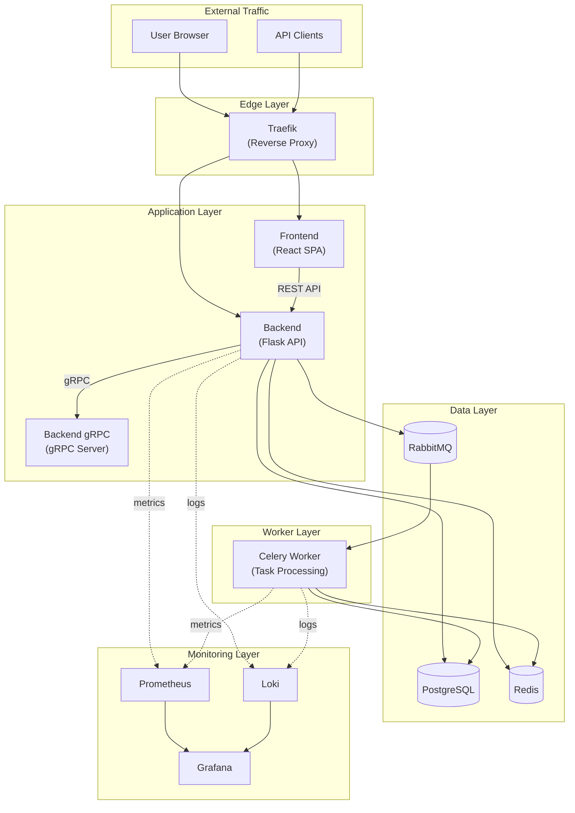
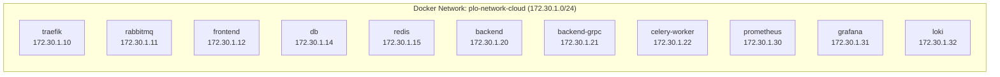

# PLOScope Architecture

## Overview

PLOScope is a poker analysis platform built on a microservices architecture. The system consists of several interconnected services that handle different aspects of the application.

## System Architecture

## Service Descriptions

### Edge Layer

#### Traefik
- **Purpose**: Reverse proxy, load balancer, SSL termination
- **Port**: 80 (HTTP), 443 (HTTPS), 8080 (Dashboard)
- **Features**:
  - Automatic SSL via Let's Encrypt
  - Docker-based service discovery
  - Request routing and load balancing
  - Access logging

### Application Layer

#### Frontend
- **Technology**: React (Create React App)
- **Purpose**: Web-based user interface
- **Port**: 3000
- **Key Features**:
  - Poker hand analysis UI
  - Real-time updates via WebSockets
  - Google OAuth integration

#### Backend
- **Technology**: Flask + Gunicorn (Eventlet)
- **Purpose**: REST API server
- **Port**: 5001
- **Key Features**:
  - User authentication (JWT)
  - Hand analysis endpoints
  - WebSocket support (Socket.IO)
  - Database operations

#### Backend gRPC
- **Technology**: Python gRPC
- **Purpose**: High-performance RPC for internal services
- **Port**: 50051
- **Key Features**:
  - Solver communication
  - Binary data transfer
  - Lower latency than REST

### Worker Layer

#### Celery Worker
- **Technology**: Celery + RabbitMQ
- **Purpose**: Asynchronous task processing
- **Key Features**:
  - Hand analysis jobs
  - Solver computations
  - Background data processing

### Data Layer

#### PostgreSQL
- **Version**: 15
- **Purpose**: Primary data store
- **Port**: 5432
- **Stores**:
  - User accounts
  - Hand histories
  - Analysis results
  - Solver outputs

#### Redis
- **Version**: 7
- **Purpose**: Caching and Celery result backend
- **Port**: 6379
- **Uses**:
  - Session caching
  - API response caching
  - Celery task results
  - Rate limiting

#### RabbitMQ
- **Version**: 3.13
- **Purpose**: Message broker
- **Ports**: 5672 (AMQP), 15672 (Management)
- **Queues**:
  - `spot-processing`: Spot analysis tasks
  - `solver-processing`: Solver computation tasks
  - Dead letter queues for failed tasks

## Network Architecture

## Data Flow

### User Request Flow
1. User makes request to `ploscope.com`
2. Traefik routes to Frontend or Backend based on path
3. Frontend SPA loaded (if web request)
4. API calls go to Backend via `/api/*`
5. Backend authenticates, processes, responds

### Analysis Task Flow
1. User submits hand for analysis
2. Backend validates and creates task
3. Task published to RabbitMQ
4. Celery Worker picks up task
5. Worker runs solver/analysis
6. Results stored in PostgreSQL
7. User notified via WebSocket

### Authentication Flow
1. User initiates Google OAuth
2. Backend validates OAuth token
3. JWT generated and returned
4. JWT stored in client
5. Subsequent requests include JWT
6. Backend validates JWT on each request

## Deployment Patterns

### Development
- All services run locally via Docker Compose
- Source code mounted as volumes for hot reload
- Debug logging enabled
- Single instance per service

### Production
- Images pulled from GitHub Container Registry
- Multiple replicas for backend and workers
- Resource limits enforced
- HTTPS via Let's Encrypt
- Log aggregation via Loki

## Scaling Considerations

### Horizontal Scaling
- **Frontend**: Stateless, easily scaled
- **Backend**: Stateless with shared Redis sessions
- **Celery Workers**: Scale based on queue depth
- **Database**: Read replicas for scaling reads

### Vertical Scaling
- **Redis**: Increase memory for larger cache
- **PostgreSQL**: Increase resources for complex queries
- **Celery Workers**: Increase concurrency per worker

## Security Architecture

### Network Security
- Internal Docker network isolation
- Only Traefik exposed to external traffic
- Database not accessible from outside

### Application Security
- JWT-based authentication
- CORS restrictions
- Rate limiting via Redis
- SQL injection prevention (SQLAlchemy ORM)
- XSS prevention (React sanitization)

### Secret Management
- Secrets via environment variables
- `.env` excluded from version control
- Docker secrets for sensitive build args
