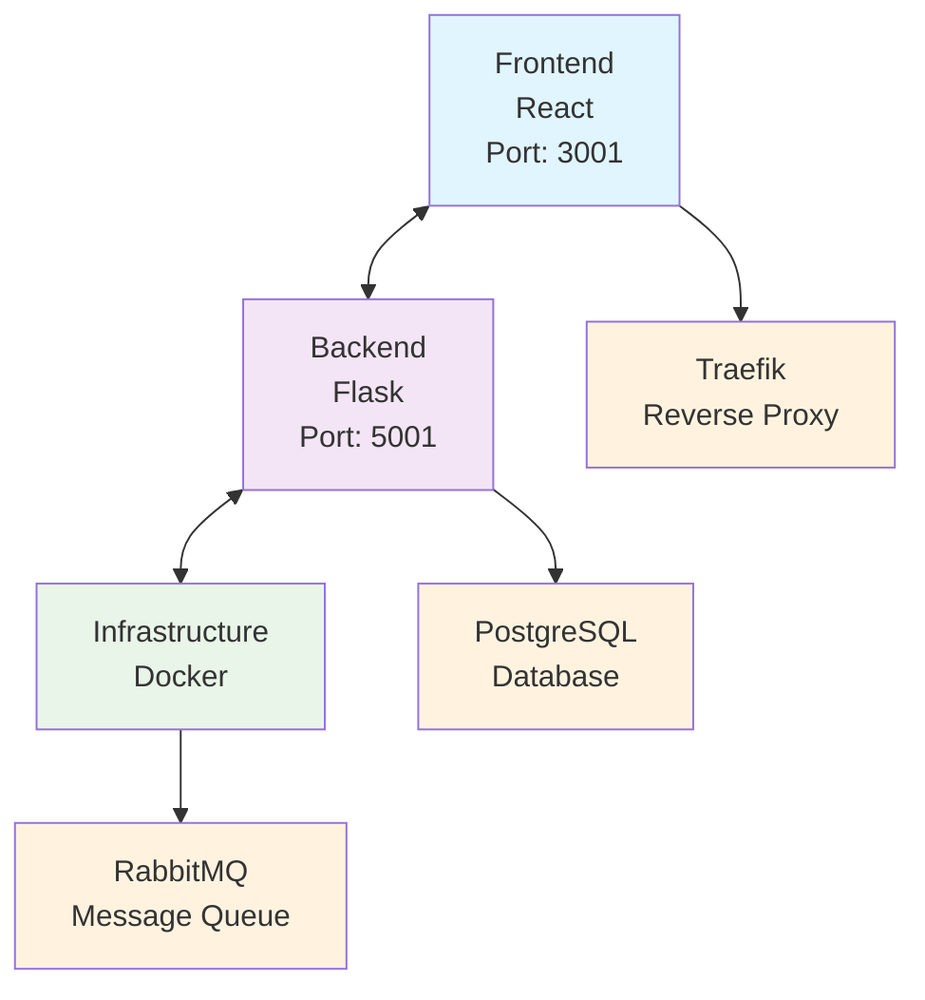
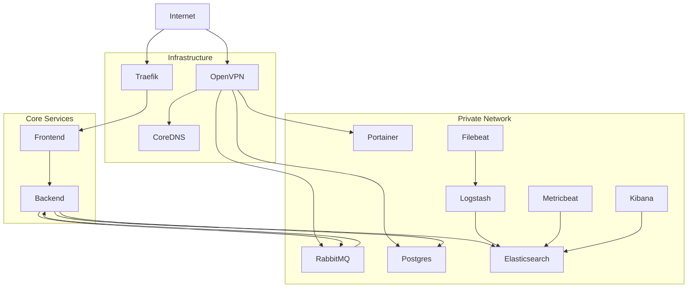

# PLOSolver

**Professional-grade Pot Limit Omaha GTO Solver**

Get started in under 5 minutes with advanced poker analysis, training, and strategy computation.


[](https://github.com/PLOScope/plo-solver/actions/workflows/build-and-push-images.yml)
[](https://github.com/PLOScope/plo-solver/actions/workflows/release.yml)
[](https://github.com/PLOScope/plo-solver/actions/workflows/security.yml)

## 📋 Table of Contents

- [🚀 Quick Start](#-quick-start)
- [⚡ Two-Terminal Workflow for Local Development](#-two-terminal-workflow-for-local-development)
- [🎯 What is PLOSolver?](#-what-is-plosolver)
- [🔧 Development Commands](#-development-commands)
  - [📋 Complete Command Reference](#-complete-command-reference)
    - [Quick Start Commands](#quick-start-commands)
    - [Development Environment Details](#development-environment-details)
    - [Testing Commands](#testing-commands)
    - [Build Commands](#build-commands)
    - [Database Commands](#database-commands)
    - [Security Commands](#security-commands)
    - [Vault Integration Commands](#vault-integration-commands)
    - [Deployment Commands](#deployment-commands)
    - [Documentation Commands](#documentation-commands)
    - [Code Quality Commands](#code-quality-commands)
    - [Cleanup Commands](#cleanup-commands)
    - [Docker Commands](#docker-commands)
    - [Setup Commands](#setup-commands)
    - [Health & Monitoring Commands](#health--monitoring-commands)
    - [CI Pipeline Commands](#ci-pipeline-commands)
- [🏗️ Architecture](#️-architecture)
  - [System Overview](#system-overview)
  - [Technology Stack](#technology-stack)
  - [Security Features](#security-features)
  - [Vault Integration](#vault-integration)
  - [Network Topology](#network-topology)
- [🧪 Testing Strategy](#-testing-strategy)
  - [Test Types](#test-types)
  - [Testing Conventions](#testing-conventions)
  - [Running Tests](#running-tests)
- [📋 Development Conventions](#-development-conventions)
  - [Code Style](#code-style)
  - [File Organization](#file-organization)
  - [Naming Conventions](#naming-conventions)
  - [Git Workflow](#git-workflow)
  - [Environment Variables](#environment-variables)
  - [Logging](#logging)
- [🚀 Getting Started for New Developers](#-getting-started-for-new-developers)
  - [Prerequisites](#prerequisites)
  - [First-Time Setup](#first-time-setup)
  - [Development Workflow](#development-workflow)
  - [Common Development Tasks](#common-development-tasks)
    - [Adding a New Feature](#adding-a-new-feature)
    - [Debugging](#debugging)
    - [Troubleshooting](#troubleshooting)
    - [Performance Optimization](#performance-optimization)
- [📚 Documentation](#-documentation)
- [🔧 Operations Runbook](#-operations-runbook)
  - [🗄️ Database Management](#️-database-management)
    - [Database Migrations](#database-migrations)
    - [Database Health Checks](#database-health-checks)
  - [🚀 Deployment Operations](#-deployment-operations)
    - [Environment Deployments](#environment-deployments)
    - [Deployment Verification](#deployment-verification)
  - [🔄 Celery Job Management](#-celery-job-management)
    - [Failed Job Retriggering](#failed-job-retriggering)
    - [Celery Worker Management](#celery-worker-management)
  - [🔍 Monitoring and Logging](#-monitoring-and-logging)
    - [Application Monitoring](#application-monitoring)
    - [Infrastructure Monitoring](#infrastructure-monitoring)
  - [🔐 Security Operations](#-security-operations)
    - [SSL Certificate Management](#ssl-certificate-management)
    - [Vault Integration](#vault-integration-1)
  - [🛠️ Troubleshooting](#️-troubleshooting)
    - [Common Issues](#common-issues)
    - [Emergency Procedures](#emergency-procedures)
  - [📊 Performance Optimization](#-performance-optimization)
    - [Resource Monitoring](#resource-monitoring)
    - [Performance Tuning](#performance-tuning)
  - [🔄 Maintenance Procedures](#-maintenance-procedures)
    - [Regular Maintenance](#regular-maintenance)
    - [Backup Procedures](#backup-procedures)
- [🎮 Features](#-features)
  - [Core Functionality](#core-functionality)
  - [User Modes](#user-modes)
  - [Advanced Features](#advanced-features)
- [🤝 Contributing](#-contributing)
  - [Contribution Guidelines](#contribution-guidelines)
- [🆘 Support](#-support)
- [📄 License](#-license)
- [🏆 Credits](#-credits)

## 🚀 Quick Start

```bash
# 1. Clone the repository
git clone https://github.com/your-repo/PLOSolver.git
cd PLOSolver

# 2. Install dependencies
make deps

# 3. Run the application
make run-local

# 4: In another terminal tab
make db-migrate

> **💡 Pro Tip**: `make run-local` intelligently reuses existing services. If you need to recreate all services (e.g., after configuration changes), use `make run-local ARGS="--recreate"`.
> 
> **🛑 Shutdown**: Press Ctrl+C once to stop local processes, twice to stop Docker containers. This preserves your Docker infrastructure for faster restarts.
```

---

## ⚡ Two-Terminal Workflow for Local Development

For local development, use a two-terminal workflow:

1. **Terminal 1:** Start backend and frontend (and infrastructure services)
   ```bash
   make run-local
   ```
   This will start the backend and frontend with hot reloading, and all infrastructure services (Postgres, RabbitMQ, Traefik) in Docker. **It does NOT start the Celery worker by default.**

2. **Terminal 2:** Start the Celery worker (with hot reloading)
   ```bash
   make run-celery-dev
   ```
   This will start the Celery worker natively, with code reload on changes. You must keep this running in a separate terminal for background jobs to be processed.

> **Note:** This workflow gives you full control and avoids accidental multiple workers. You can stop and restart the worker independently of the main app.

---

**That's it!** PLOSolver will be running at:
- **Traefik Proxy**: https://localhost (HTTP automatically redirects to HTTPS)
- **Frontend**: https://localhost:3000
- **Backend**: https://localhost:5001

## 🎯 What is PLOSolver?

PLOSolver is a comprehensive tool for Pot Limit Omaha players to:

- 📊 **Analyze any poker spot** with GTO strategies
- 🎮 **Train against AI opponents** with different styles
- 🧮 **Calculate precise equity** for any situation
- 📈 **Study hand histories** and improve your game
- 💡 **Get real-time strategy suggestions**

## 🔧 Development Commands

All common tasks are available through our Makefile:

```bash
make help           # Show all available commands
make deps           # Install all dependencies
make run            # Start development servers
make test           # Run all tests
make build          # Build for production
make clean          # Clean build artifacts
make health         # Check application status
```

### 📋 Complete Command Reference

#### **Quick Start Commands**
```bash
make deps           # Install all dependencies (Python, Node.js, system)
make deps-python    # Install Python dependencies only
make deps-node      # Install Node.js dependencies only
make run            # Run the application (development mode)
make run-local      # Run frontend/backend locally with Docker infrastructure (reuses existing services)
make run-local ARGS="--recreate"  # Run with Docker infrastructure, recreating all services
make run-docker     # Run with Docker
make dev            # Run with hot reloading enabled
```

#### **Development Environment Details**

The `make run-local` command intelligently manages your development environment:

- **Smart Service Detection**: Automatically detects if PLOSolver services (plosolver-*-local containers) are already running
- **Service Reuse**: If services are running, it will reuse them instead of recreating everything
- **Forced Recreation**: Use `make run-local ARGS="--recreate"` to force recreation of all services
- **Infrastructure Services**: Runs Traefik, RabbitMQ, PostgreSQL, and Celery in Docker containers
- **Local Development**: Runs frontend and backend locally for faster development and debugging
- **Two-Stage Shutdown**: Graceful shutdown process that preserves Docker infrastructure

**Example Usage:**
```bash
# First time or when services aren't running
make run-local

# Force recreation of all services (useful after configuration changes)
make run-local ARGS="--recreate"

# Normal development (reuses existing services)
make run-local
```

**Shutdown Process:**
The development environment uses a two-stage shutdown process for better workflow:

1. **First Ctrl+C**: Stops only local development processes (frontend/backend)
   - Docker containers remain running for faster subsequent starts
   - Useful for quick restarts during development

2. **Second Ctrl+C**: Stops all Docker containers
   - Complete shutdown of the entire environment
   - Use when you're done developing for the day

**Benefits:**
- **Faster Iteration**: Restart local processes without waiting for Docker services
- **Preserved Infrastructure**: Docker containers stay running between development sessions
- **Accidental Prevention**: Prevents accidental Docker container shutdown
- **Clear Feedback**: Informative messages guide you through the shutdown process
```

#### **Testing Commands**
```bash
make test                    # Run all tests (frontend + backend + selenium)
make test-unit              # Run all unit tests
make test-integration       # Run all integration tests using Cucumber
make test-cucumber          # Run Cucumber integration tests
make test-cucumber-local    # Run Cucumber integration tests against local development environment
make test-cucumber-ci       # Run Cucumber integration tests using CI services
make test-frontend          # Run all frontend tests
make test-frontend-unit     # Run frontend unit tests only
make test-backend           # Run all backend tests
make test-backend-unit      # Run backend unit tests only
make test-selenium          # Run Selenium browser tests with setup
make test-selenium-comprehensive # Run comprehensive Selenium tests
make test-selenium-plo      # Run PLO-specific Selenium tests
make test-selenium-setup    # Setup Selenium test environment
make test-selenium-quick    # Run Selenium tests without setup (for development)
make test-coverage          # Run unit tests with coverage reports
```

#### **Build Commands**
```bash
make build                 # Build the application
make build-docker          # Build Docker images
make build-docker-staging  # Build Docker images for staging
make build-docker-no-cache # Build Docker images without cache
make build-docker-pull     # Build Docker images with latest base images
```

#### **Database Commands**
```bash
make db-reset             # Reset database
make db-migrate           # Run database migrations
```

#### **Security Commands**
```bash
make security             # Run security checks
make security-setup       # Set up security tools
```

#### **Vault Integration Commands**
```bash
make vault-load-dev       # Load development secrets from external Vault
make vault-load-staging   # Load staging secrets from external Vault
make vault-load-production # Load production secrets from external Vault
make vault-get-dev        # Get development secrets from external Vault
make vault-get-staging    # Get staging secrets from external Vault
make vault-get-production # Get production secrets from external Vault
make vault-test           # Test Vault connection and authentication
make vault-list           # List available secrets in Vault
```

#### **Deployment Commands**
```bash
make staging-deploy       # Deploy to staging environment (local build)
```

### Image Tagging and Deployment Flow (GitHub Actions only)

- PR builds: Images are tagged as `PR-<PR_NUMBER>` and pushed to Docker Hub.
- Merge to master/main: Images are tagged as `staging`.
- Release tags: When you manually create a GitHub Release with a tag like `v1.2.3`, images are tagged as `1.2.3` and `latest`.

Notes:
- Builds and pushes are handled by `.github/workflows/build-and-push-images.yml`.
- Cutting a release is manual in the GitHub UI (Releases → “Draft a new release”).

### Using image tags with Docker Compose

Both `docker-compose.staging.yml` and `docker-compose.production.yml` accept an `IMAGE_TAG` variable:
- Staging default: `IMAGE_TAG` defaults to `staging`
- Production default: `IMAGE_TAG` defaults to `production`

Examples:

```bash
# Staging with default tags
docker compose -f docker-compose.staging.yml --env-file env.staging up -d

# Staging using a PR image (e.g., PR-123)
IMAGE_TAG=PR-123 docker compose -f docker-compose.staging.yml --env-file env.staging pull
IMAGE_TAG=PR-123 docker compose -f docker-compose.staging.yml --env-file env.staging up -d

# Production with default tags
docker compose -f docker-compose.production.yml --env-file env.production up -d

# Production using a release image (e.g., 1.2.3)
IMAGE_TAG=1.2.3 docker compose -f docker-compose.production.yml --env-file env.production up -d
```

### Ansible deployment parameters (branch and image tag)

Ansible deployments support selecting the Git branch and Docker image tag at deploy time.

- Defaults (configure once) in `server/ansible/variables/vars.yml`:
  - `git_branch`: branch to pull and deploy (e.g., `master`, `staging`, `feature/x`)
  - `image_tag`: tag to deploy (e.g., `PR-123`, `staging`, `production`, `1.2.3`)

- Override per run using `--extra-vars`:

```bash
cd server/ansible
ansible-playbook \
  -i inventories/inventory.yml \
  --extra-vars "@variables/vars.yml" \
  --extra-vars "git_branch=master image_tag=staging" \
  playbooks/03_deploy/01_deploy.yml
```

This injects `IMAGE_TAG` into Compose and checks out the specified `git_branch` before deploying.

#### **Documentation Commands**
```bash
make docs                 # Generate documentation
make docs-serve           # Serve documentation locally
```

#### **Code Quality Commands**
```bash
make lint                 # Run linting
make lint-fix             # Auto-fix lint errors (frontend and backend)
make format               # Format code
```

#### **Cleanup Commands**
```bash
make clean                # Clean build artifacts
make clean-frontend       # Clean frontend build artifacts only
```

#### **Docker Commands**
```bash
make docker-logs          # Show Docker logs
make docker-stop          # Stop Docker containers
make localdev-stop        # Stop local development environment
make local-services-stop  # Stop local Docker infrastructure services
make docker-restart       # Restart Docker containers
```

#### **Setup Commands**
```bash
make setup-discourse      # Set up Discourse forum
make setup-solver         # Set up solver engine
make setup-pre-commit     # Set up pre-commit hook for CI pipeline
make setup                # Prepare RabbitMQ and Postgres for development
```

#### **Health & Monitoring Commands**
```bash
make health               # Check application health
make check-docker         # Check Docker setup
```

#### **CI Pipeline Commands**
```bash
make ci-pipeline          # Run the full CI pipeline locally (pre-commit hook)
make ci-pipeline-docker   # Run the full CI pipeline in isolated Docker container
make ci-pipeline-quick    # Run quick CI pipeline (faster version)
```

## 🏗️ Architecture

### System Overview

PLOSolver is built as a modern web application with the following architecture:



### Technology Stack

- **Frontend**: React, JavaScript, Webpack
- **Backend**: Python, Flask, SQLAlchemy, NumPy
- **Database**: PostgreSQL (production), SQLite (development)
- **Message Queue**: RabbitMQ
- **Reverse Proxy**: Traefik
- **Containerization**: Docker & Docker Compose
- **Monitoring**: ELK Stack (Elasticsearch, Logstash, Kibana)
- **VPN**: OpenVPN for secure access

### Security Features

- **Automatic HTTPS**: All HTTP traffic automatically redirects to HTTPS
- **Let's Encrypt Integration**: Automatic SSL certificate generation and renewal
- **ACME Challenge Support**: Proper handling of certificate validation
- **Secure Headers**: CORS and security headers configured
- **VPN Access**: Secure access to admin services via OpenVPN
- **Vault Integration**: External HashiCorp Vault for secrets management

### Vault Integration

PLOSolver supports integration with external HashiCorp Vault instances for secure secrets management:

#### **Setup**
1. Configure environment variables:
   ```bash
   export VAULT_ADDR=http://your-vault-server:8200
   export VAULT_TOKEN=your-vault-token
   export VAULT_SECRET_PATH=secret/plo-solver
   ```

2. Load secrets for your environment:
   ```bash
   make vault-load-dev      # Development
   make vault-load-staging  # Staging
   make vault-load-production # Production
   ```

#### **Usage**
- **Load secrets**: `make vault-load-<environment>`
- **Get secrets**: `make vault-get-<environment>`
- **Test connection**: `make vault-test`
- **List secrets**: `make vault-list`

For detailed Vault integration instructions, see [Vault Integration Guide](docs/05-architecture/vault-integration.md).

### Network Topology



## 🧪 Testing Strategy

### Test Types

1. **Unit Tests** - Test individual functions and components
   - Frontend: Jest + React Testing Library
   - Backend: pytest
   - Run with: `make test-unit`

2. **Integration Tests** - Test component interactions
   - Frontend: Component integration tests
   - Backend: API endpoint tests
   - Run with: `make test-integration`

3. **Selenium Tests** - End-to-end browser tests
   - Comprehensive test suite
   - PLO-specific scenarios
   - Screenshot capture on failure
   - Run with: `make test-selenium`

### Testing Conventions

- **Test Naming**: `ComponentName.test.js` for unit tests
- **Test Organization**: Grouped by feature/component
- **Coverage**: Aim for >80% code coverage
- **Mocking**: Use mocks for external dependencies
- **Fixtures**: Use consistent test data

### Running Tests

```bash
# Run all tests
make test

# Run specific test types
make test-unit
make test-integration
make test-selenium

# Run with coverage
make test-coverage

# Quick selenium tests (development)
make test-selenium-quick
```

## 📋 Development Conventions

### Code Style

- **Frontend**: ESLint + Prettier
- **Backend**: Black + flake8
- **Auto-fix**: `make lint-fix`
- **Format**: `make format`

### File Organization

```
src/
├── frontend/          # React application
│   ├── components/    # Reusable UI components
│   ├── pages/        # Page components
│   ├── hooks/        # Custom React hooks
│   ├── utils/        # Utility functions
│   └── styles/       # CSS/SCSS files
├── backend/          # Flask application
│   ├── routes/       # API endpoints
│   ├── services/     # Business logic
│   ├── models/       # Database models
│   └── utils/        # Utility functions
└── simulation/       # Poker simulation scripts
```

### Naming Conventions

- **Files**: kebab-case (e.g., `card-picker.js`)
- **Components**: PascalCase (e.g., `CardPicker`)
- **Functions**: camelCase (e.g., `calculateEquity`)
- **Constants**: UPPER_SNAKE_CASE (e.g., `MAX_PLAYERS`)
- **Database**: snake_case (e.g., `user_sessions`)

### Git Workflow

1. **Feature Branches**: Create from `main`
2. **Commit Messages**: Use conventional commits
3. **Pre-commit**: Run `make ci-pipeline` before pushing
4. **Pull Requests**: Require CI pipeline to pass

### Environment Variables

- **Development**: `env.development`
- **Testing**: `env.test`
- **Staging**: `env.staging`
- **Production**: `env.production`

### Logging

- Use structured logging with context
- Frontend: `console.log` for development, structured logging for production
- Backend: Python logging module
- Avoid debug prints in production code

## 🚀 Getting Started for New Developers

### Prerequisites

- **Python 3.8+**
- **Node.js 16+**
- **Docker & Docker Compose**
- **4GB RAM minimum** (8GB recommended)
- **Modern web browser**

### First-Time Setup

1. **Clone and Install Dependencies**
   ```bash
   git clone https://github.com/your-repo/PLOSolver.git
   cd PLOSolver
   make deps
   ```

2. **Set Up Development Environment**
   ```bash
   make setup  # Sets up RabbitMQ and PostgreSQL
   ```

3. **Run Database Migrations**
   ```bash
   make db-migrate  # Initialize database schema
   ```

4. **Start Development Server**
   ```bash
   make dev    # Runs with hot reloading
   ```

5. **Run Tests**
   ```bash
   make test   # Ensures everything works
   ```

### Development Workflow

1. **Start Development**
   ```bash
   make dev
   ```

2. **Make Changes** - Edit code in `src/frontend/` or `src/backend/`

3. **Run Tests**
   ```bash
   make test-unit      # Quick unit tests
   make test-selenium  # Full browser tests
   ```

4. **Check Code Quality**
   ```bash
   make lint
   make lint-fix       # Auto-fix issues
   ```

5. **Commit Changes**
   ```bash
   make ci-pipeline    # Run full CI pipeline
   git add .
   git commit -m "feat: add new feature"
   ```

### Common Development Tasks

#### Adding a New Feature

1. Create feature branch: `git checkout -b feature/new-feature`
2. Implement in `src/frontend/` or `src/backend/`
3. Add tests in corresponding `__tests__/` directory
4. Run tests: `make test`
5. Update documentation if needed
6. Submit pull request

#### Debugging

- **Frontend**: Use browser dev tools and React DevTools
- **Backend**: Use Python debugger or logging
- **Docker**: `make docker-logs` for container logs
- **Database**: Connect directly to PostgreSQL container

#### Troubleshooting

**Port Conflicts:**
- If ports 3001 or 5001 are in use, the script will automatically attempt to clear them
- For persistent issues: `lsof -ti :3001 | xargs kill -9` or `lsof -ti :5001 | xargs kill -9`

**Docker Container Issues:**
- If Docker containers aren't starting: `make run-local ARGS="--recreate"`
- To check container status: `docker ps | grep plosolver`
- To view logs: `docker logs plosolver-backend-local` or `docker logs plosolver-frontend-local`

**Shutdown Issues:**
- If the two-stage shutdown isn't working, you can manually stop containers: `make localdev-stop`
- To force kill all processes: `pkill -f "python.*core/app.py" && pkill -f "webpack.*serve"`

#### Performance Optimization

- **Frontend**: Use React DevTools Profiler
- **Backend**: Use Python profiling tools
- **Database**: Monitor query performance
- **Docker**: Monitor container resource usage

## 📚 Documentation

Our documentation is organized for easy navigation:

- **[🚀 Getting Started](docs/01-getting-started/)** - User guides and tutorials
- **[⚙️ Setup](docs/02-setup/)** - Installation and configuration
- **[💻 Development](docs/03-development/)** - Contributing and development
- **[📋 Deployment Guide](docs/03-development/deployment-guide.md)** - GitHub Actions deployment workflows and PR deployments
- **[🏗️ Architecture](docs/05-architecture/)** - System design and technical details
- **[🧪 Testing](docs/06-testing/)** - Testing guides and best practices
- **[🔌 Integrations](docs/07-integrations/)** - Third-party integrations
- **[📄 Legal](docs/08-legal/)** - Privacy policy and terms

## 🔧 Operations Runbook

This runbook provides essential administrative procedures for managing PLOSolver in production and development environments.

### 🗄️ Database Management

#### Database Migrations

**Apply New Migrations:**
```bash
# Apply all pending migrations
make db-migrate

# Check migration status
cd src/backend && flask db current
cd src/backend && flask db history
```

**Rollback Migrations:**
```bash
# Rollback to previous migration
cd src/backend && flask db downgrade

# Rollback to specific revision
cd src/backend && flask db downgrade <revision_id>
```

**Create New Migration:**
```bash
# Generate migration from model changes
cd src/backend && flask db migrate -m "Description of changes"

# Edit the generated migration file if needed
# Then apply with: make db-migrate
```

**Reset Database (Development Only):**
```bash
# ⚠️ WARNING: This will delete all data!
make db-reset
```

#### Database Health Checks

**Check Database Connection:**
```bash
# Test connection
make health

# Check specific database status
docker exec -it plosolver-db-local psql -U postgres -d plosolver -c "SELECT version();"
```

**Database Backup:**
```bash
# Create backup
docker exec -it plosolver-db-local pg_dump -U postgres plosolver > backup_$(date +%Y%m%d_%H%M%S).sql

# Restore from backup
docker exec -i plosolver-db-local psql -U postgres plosolver < backup_file.sql
```

### 🚀 Deployment Operations

#### Environment Deployments

**Staging Deployment:**
```bash
# Deploy to staging (triggers on master branch merge)
make staging-deploy

# Manual staging deployment
make build-docker-staging
docker-compose -f docker-compose.staging.yml up -d
```

**Production Deployment:**
```bash
# Production deployment (requires release tag)
git tag v1.0.0
git push origin v1.0.0

# Manual production deployment
make build-docker
docker-compose -f docker-compose.production.yml up -d
```

#### Deployment Verification

**Health Check After Deployment:**
```bash
# Check all services
make health

# Check specific endpoints
curl -k https://localhost:5001/health
curl -k https://localhost:3001

# Check Docker containers
docker ps | grep plosolver
```

**Rollback Deployment:**
```bash
# Rollback to previous version
docker-compose -f docker-compose.production.yml down
docker tag plosolver:previous-version plosolver:latest
docker-compose -f docker-compose.production.yml up -d
```

### 🔄 Celery Job Management

#### Failed Job Retriggering

**List Failed Jobs:**
```bash
# View all failed jobs in Dead Letter Queues
./scripts/testing/retrigger_failed_jobs.sh --list

# Verbose output with details
./scripts/testing/retrigger_failed_jobs.sh --list --verbose
```

**Retrigger Failed Jobs:**
```bash
# Retrigger all failed jobs
./scripts/testing/retrigger_failed_jobs.sh --retrigger-all

# Retrigger specific job by ID
./scripts/testing/retrigger_failed_jobs.sh --retrigger-job <job_id>

# Example
./scripts/testing/retrigger_failed_jobs.sh --retrigger-job abc123-def456-7890
```

**Clear Failed Jobs (Dangerous!):**
```bash
# ⚠️ WARNING: This permanently deletes all failed jobs!
./scripts/testing/retrigger_failed_jobs.sh --clear-all
```

#### Celery Worker Management

**Check Worker Status:**
```bash
# List active workers
ps aux | grep celery

# Check Celery worker logs
docker logs plosolver-celery-local

# Monitor Celery tasks
cd src/celery && celery -A src.main.celery_app inspect active
```

**Restart Celery Workers:**
```bash
# Restart Celery worker
make run-celery-dev

# Or restart Docker-based worker
docker restart plosolver-celery-local
```

**Purge Celery Queues:**
```bash
# Purge all queues (emergency only)
cd src/celery && celery -A src.main.celery_app purge

# Purge specific queue
cd src/celery && celery -A src.main.celery_app purge -Q spot-processing
```

### 🔍 Monitoring and Logging

#### Application Monitoring

**Check Application Health:**
```bash
# Overall health check
make health

# Check specific services
curl -k https://localhost:5001/api/health
curl -k https://localhost:3001/health
```

**View Application Logs:**
```bash
# Backend logs
tail -f logs/app.log
docker logs -f plosolver-backend-local

# Frontend logs
docker logs -f plosolver-frontend-local

# All container logs
make docker-logs
```

#### Infrastructure Monitoring

**RabbitMQ Management:**
```bash
# Access RabbitMQ management UI
open http://localhost:15672
# Username: guest, Password: guest

# Check RabbitMQ status
docker logs plosolver-rabbitmq-local
```

**PostgreSQL Monitoring:**
```bash
# Check PostgreSQL logs
docker logs plosolver-db-local

# Monitor database connections
docker exec -it plosolver-db-local psql -U postgres -d plosolver -c "SELECT * FROM pg_stat_activity;"
```

### 🔐 Security Operations

#### SSL Certificate Management

**Check Certificate Status:**
```bash
# Check certificate expiration
./scripts/operations/cert-monitor.sh

# Verify certificate validity
openssl x509 -in /path/to/cert.pem -text -noout
```

**Renew Certificates:**
```bash
# Force certificate renewal
docker-compose exec traefik traefik-cert-manager renew

# Check ACME storage
./scripts/operations/check-acme-storage.sh
```

#### Vault Integration

**Load Secrets:**
```bash
# Load secrets for different environments
make vault-load-dev
make vault-load-staging
make vault-load-production

# Test Vault connection
make vault-test
```

**Manage Secrets:**
```bash
# List available secrets
make vault-list

# Get specific secrets
make vault-get-dev
make vault-get-staging
make vault-get-production
```

### 🛠️ Troubleshooting

#### Common Issues

**Service Won't Start:**
```bash
# Check for port conflicts
lsof -i :3001
lsof -i :5001

# Clear port conflicts
lsof -ti :3001 | xargs kill -9
lsof -ti :5001 | xargs kill -9
```

**Database Connection Issues:**
```bash
# Check database container
docker ps | grep postgres

# Restart database
docker restart plosolver-db-local

# Check database logs
docker logs plosolver-db-local
```

**Celery Job Failures:**
```bash
# Check Celery worker status
ps aux | grep celery

# Restart Celery worker
make run-celery-dev

# Check failed jobs
./scripts/testing/retrigger_failed_jobs.sh --list
```

#### Emergency Procedures

**Complete System Restart:**
```bash
# Stop all services
make localdev-stop

# Clear all containers
docker-compose down -v

# Restart with fresh state
make run-local ARGS="--recreate"
```

**Data Recovery:**
```bash
# Create emergency backup
docker exec -it plosolver-db-local pg_dump -U postgres plosolver > emergency_backup.sql

# Restore from backup
docker exec -i plosolver-db-local psql -U postgres plosolver < emergency_backup.sql
```

### 📊 Performance Optimization

#### Resource Monitoring

**Check Resource Usage:**
```bash
# Monitor Docker resource usage
docker stats

# Check disk space
df -h

# Monitor memory usage
free -h
```

**Performance Tuning:**
```bash
# Optimize database queries
docker exec -it plosolver-db-local psql -U postgres -d plosolver -c "SELECT * FROM pg_stat_statements ORDER BY total_time DESC LIMIT 10;"

# Check slow queries
docker exec -it plosolver-db-local psql -U postgres -d plosolver -c "SELECT * FROM pg_stat_activity WHERE state = 'active';"
```

### 🔄 Maintenance Procedures

#### Regular Maintenance

**Daily Checks:**
- [ ] Application health: `make health`
- [ ] Failed jobs: `./scripts/testing/retrigger_failed_jobs.sh --list`
- [ ] Disk space: `df -h`
- [ ] Log file sizes: `du -sh logs/*`

**Weekly Tasks:**
- [ ] Database backup
- [ ] Log rotation
- [ ] Certificate expiration check
- [ ] Performance monitoring review

**Monthly Tasks:**
- [ ] Security updates
- [ ] Dependency updates
- [ ] Performance optimization review
- [ ] Documentation updates

#### Backup Procedures

**Automated Backups:**
```bash
# Create automated backup script
#!/bin/bash
DATE=$(date +%Y%m%d_%H%M%S)
docker exec -it plosolver-db-local pg_dump -U postgres plosolver > /backups/plosolver_$DATE.sql
find /backups -name "*.sql" -mtime +7 -delete
```

**Backup Verification:**
```bash
# Test backup restoration
docker exec -i plosolver-db-local psql -U postgres plosolver_test < backup_file.sql
```

## 🎮 Features

### Core Functionality
- **GTO Solver Engine** - Advanced CFR algorithm for optimal strategies
- **Equity Calculator** - Precise mathematical calculations
- **Multi-board Support** - Single and double-board Omaha variants
- **Range Analysis** - Comprehensive hand range tools

### User Modes
- **Spot Mode** - Quick analysis of specific situations
- **Solver Mode** - Deep GTO strategy computation
- **Training Mode** - Practice against AI opponents
- **Hand History Analysis** - Review and learn from past hands

### Advanced Features
- **Machine Learning** - AI-powered strategy suggestions
- **Bulk Processing** - Analyze multiple spots simultaneously
- **Custom Profiles** - Model different opponent types
- **Real-time Updates** - Live strategy adjustments

## 🤝 Contributing

We welcome contributions! Here's how to get started:

1. **Read our [Development Guide](docs/03-development/2024-01-01-development-guide.md)**
2. **Set up your development environment**: `make deps && make dev`
3. **Make your changes and add tests**
4. **Submit a pull request**

### Contribution Guidelines

- Follow the established code style
- Write tests for new functionality
- Update documentation as needed
- Ensure CI pipeline passes
- Use conventional commit messages

## 🆘 Support

- **📖 Documentation**: [docs/](docs/)
- **🐛 Issues**: [GitHub Issues](https://github.com/your-repo/issues)
- **💬 Discussions**: [GitHub Discussions](https://github.com/your-repo/discussions)
- **📧 Email**: support@plosolver.com

## 📄 License

MIT License - see [LICENSE](LICENSE) for details.

## 🏆 Credits

Built with ❤️ by the PLOSolver team and contributors.

---

**Ready to analyze your first poker spot?** Run `make deps && make run` and start solving!

