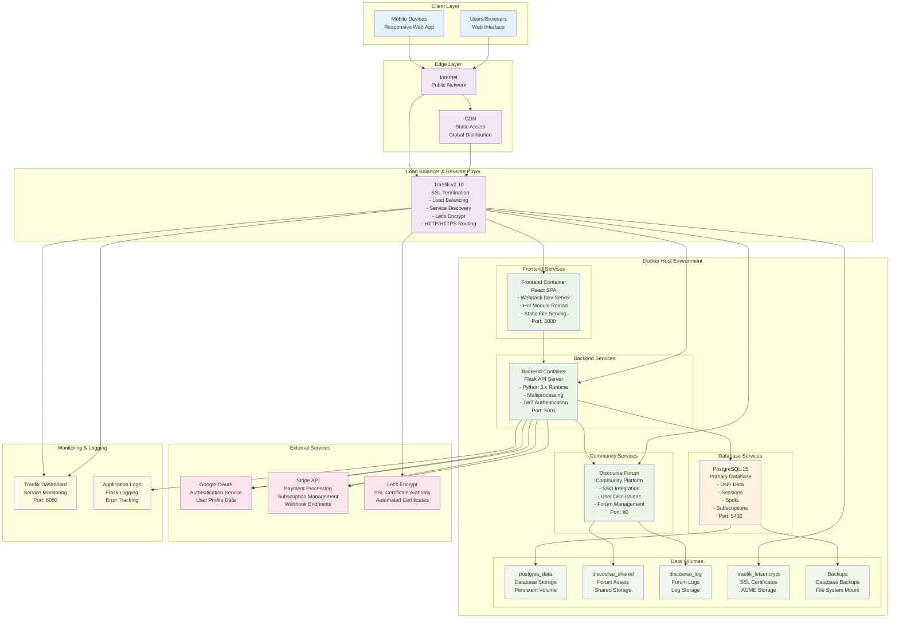

# PLOSolver Deployment Architecture

This document describes the deployment infrastructure, containerization strategy, and production environment setup for the PLOSolver application.

## Deployment Infrastructure Diagram



## Container Configuration

### 1. Docker Compose Structure

```yaml
# docker compose.yml
services:
  traefik:
    image: traefik:v2.10
    command:
      - "--api.insecure=${TRAEFIK_DASHBOARD_ENABLED:-true}"
      - "--providers.docker=true"
      - "--providers.docker.exposedbydefault=false"
      - "--entrypoints.web.address=:80"
      - "--entrypoints.websecure.address=:443"
      - "--certificatesresolvers.letsencrypt.acme.httpchallenge=true"
    ports:
      - "80:80"
      - "443:443"
      - "8080:8080"
    volumes:
      - /var/run/docker.sock:/var/run/docker.sock:ro
      - traefik_letsencrypt:/letsencrypt
    networks:
      - plo-network

  frontend:
    build:
      context: .
      dockerfile: Dockerfile
    labels:
      - "traefik.enable=true"
      - "traefik.http.routers.frontend-http.rule=Host(`${FRONTEND_DOMAIN:-localhost}`)"
      - "traefik.http.routers.frontend-http.entrypoints=web"
      - "traefik.http.services.frontend.loadbalancer.server.port=3000"
    environment:
      - NODE_ENV=${NODE_ENV:-development}
      - REACT_APP_API_URL=${REACT_APP_API_URL:-/api}
    depends_on:
      - backend
    networks:
      - plo-network

  backend:
    build:
      context: .
      dockerfile: Dockerfile
    labels:
      - "traefik.enable=true"
      - "traefik.http.routers.backend-http.rule=Host(`${FRONTEND_DOMAIN:-localhost}`) && PathPrefix(`/api`)"
      - "traefik.http.middlewares.backend-stripprefix.stripprefix.prefixes=/api"
      - "traefik.http.services.backend.loadbalancer.server.port=5001"
    environment:
              - FLASK_DEBUG=${FLASK_DEBUG:-true}
      - DATABASE_URL=postgresql://${POSTGRES_USER:-postgres}:${POSTGRES_PASSWORD:-postgres}@db:5432/${POSTGRES_DB:-plosolver}
      - SECRET_KEY=${SECRET_KEY:-dev-secret-key}
      - JWT_SECRET_KEY=${JWT_SECRET_KEY:-jwt-secret-key}
    depends_on:
      - db
    networks:
      - plo-network

  db:
    image: postgres:15
    environment:
      - POSTGRES_USER=${POSTGRES_USER:-postgres}
      - POSTGRES_PASSWORD=${POSTGRES_PASSWORD:-postgres}
      - POSTGRES_DB=${POSTGRES_DB:-plosolver}
    volumes:
      - postgres_data:/var/lib/postgresql/data
      - ./backups:/backups
    networks:
      - plo-network
    healthcheck:
      test: ["CMD-SHELL", "pg_isready -U ${POSTGRES_USER:-postgres}"]
      interval: 5s
      timeout: 5s
      retries: 5

  discourse:
    image: discourse/base:2.0.20241202-1135
    labels:
      - "traefik.enable=true"
      - "traefik.http.routers.discourse-http.rule=Host(`${DISCOURSE_DOMAIN:-forum.localhost}`)"
      - "traefik.http.services.discourse.loadbalancer.server.port=80"
    volumes:
      - discourse_shared:/shared
      - discourse_log:/var/log
    environment:
      - DISCOURSE_HOSTNAME=${DISCOURSE_DOMAIN:-forum.localhost}
      - DISCOURSE_SSO_SECRET=${DISCOURSE_SSO_SECRET:-change-this-secret}
    networks:
      - plo-network

volumes:
  postgres_data:
  discourse_shared:
  discourse_log:
  traefik_letsencrypt:

networks:
  plo-network:
```

### 2. Frontend Dockerfile

```dockerfile
# src/frontend/Dockerfile
FROM node:18-alpine AS builder

WORKDIR /app

# Copy package files
COPY package*.json ./
RUN npm ci --only=production

# Copy source code
COPY src/ ./src/
COPY public/ ./public/
COPY webpack.config.js ./

# Build application
ARG BUILD_ENV=production
ENV NODE_ENV=${BUILD_ENV}
RUN npm run build

# Production stage
FROM nginx:alpine

# Copy built application
COPY --from=builder /app/dist /usr/share/nginx/html

# Copy nginx configuration
COPY nginx.conf /etc/nginx/nginx.conf

EXPOSE 3000

CMD ["nginx", "-g", "daemon off;"]
```

### 3. Backend Dockerfile

```dockerfile
# src/backend/Dockerfile
FROM python:3.11-slim

WORKDIR /app

# Install system dependencies
RUN apt-get update && apt-get install -y \
    gcc \
    g++ \
    libpq-dev \
    && rm -rf /var/lib/apt/lists/*

# Copy requirements and install Python dependencies
COPY requirements.txt .
RUN pip install --no-cache-dir -r requirements.txt

# Copy backend code
COPY backend/ ./backend/

# Set Python path
ENV PYTHONPATH=/app/backend

# Create non-root user
RUN useradd -m -u 1001 appuser && chown -R appuser:appuser /app
USER appuser

EXPOSE 5001

CMD ["python", "backend/equity_server.py"]
```

## Environment Configuration

### 1. Environment Files

#### Development Environment (`.env`)
```bash
# Application
NODE_ENV=development
FLASK_DEBUG=true
BUILD_ENV=development

# Database
POSTGRES_USER=postgres
POSTGRES_PASSWORD=postgres
POSTGRES_DB=plosolver
DATABASE_URL=postgresql://postgres:postgres@db:5432/plosolver

# Security
SECRET_KEY=dev-secret-key-change-in-production
JWT_SECRET_KEY=dev-jwt-secret-key-change-in-production

# OAuth
GOOGLE_CLIENT_ID=your-google-client-id
GOOGLE_CLIENT_SECRET=your-google-client-secret

# Payment
STRIPE_PUBLISHABLE_KEY=pk_test_...
STRIPE_SECRET_KEY=sk_test_...
STRIPE_WEBHOOK_SECRET=whsec_...

# Traefik
TRAEFIK_DOMAIN=localhost
FRONTEND_DOMAIN=localhost
TRAEFIK_DASHBOARD_ENABLED=true
TRAEFIK_HTTPS_ENABLED=false

# Forum
DISCOURSE_DOMAIN=forum.localhost
DISCOURSE_SSO_SECRET=change-this-secret
DISCOURSE_DEVELOPER_EMAILS=admin@localhost

# Logging
LOG_LEVEL=DEBUG
```

#### Production Environment (`.env.production`)
```bash
# Application
NODE_ENV=production
FLASK_DEBUG=false
BUILD_ENV=production

# Database
POSTGRES_USER=plosolver_user
POSTGRES_PASSWORD=secure_random_password
POSTGRES_DB=plosolver_prod
DATABASE_URL=postgresql://plosolver_user:secure_random_password@db:5432/plosolver_prod

# Security
SECRET_KEY=secure-random-secret-key-32-chars
JWT_SECRET_KEY=secure-random-jwt-secret-key-32-chars

# OAuth
GOOGLE_CLIENT_ID=your-production-google-client-id
GOOGLE_CLIENT_SECRET=your-production-google-client-secret

# Payment
STRIPE_PUBLISHABLE_KEY=pk_live_...
STRIPE_SECRET_KEY=sk_live_...
STRIPE_WEBHOOK_SECRET=whsec_...

# Traefik
TRAEFIK_DOMAIN=plosolver.com
FRONTEND_DOMAIN=plosolver.com
TRAEFIK_DASHBOARD_ENABLED=false
TRAEFIK_HTTPS_ENABLED=true
ACME_EMAIL=admin@plosolver.com

# Forum
DISCOURSE_DOMAIN=forum.plosolver.com
DISCOURSE_SSO_SECRET=secure-random-sso-secret
DISCOURSE_DEVELOPER_EMAILS=admin@plosolver.com

# Logging
LOG_LEVEL=INFO
```

### 2. Traefik Configuration

```yaml
# server/traefik/traefik.yml
api:
  dashboard: true
  insecure: true

entryPoints:
  web:
    address: ":80"
    http:
      redirections:
        entryPoint:
          to: websecure
          scheme: https
  websecure:
    address: ":443"

providers:
  docker:
    exposedByDefault: false
    network: plo-network

certificatesResolvers:
  letsencrypt:
    acme:
      httpChallenge:
        entryPoint: web
      email: ${ACME_EMAIL}
      storage: /letsencrypt/acme.json
```

## Deployment Strategies

### 1. Development Deployment

```bash
# Start development environment
docker compose --profile app up -d

# View logs
docker compose logs -f

# Stop services
docker compose down

# Rebuild after code changes
docker compose up --build
```

### 2. Production Deployment

```bash
# Production deployment with Traefik
docker compose --profile traefik --profile app up -d

# Scale services
docker compose up --scale backend=3 -d

# Rolling updates
docker compose up --force-recreate --no-deps backend
```

### 3. Blue-Green Deployment

```bash
# Deploy to green environment
docker compose -f docker-compose.green.yml up -d

# Switch traffic (update Traefik labels)
# Test green environment
# Decommission blue environment
```

## Service Discovery and Load Balancing

### 1. Traefik Service Discovery

Traefik automatically discovers services through Docker labels:

```yaml
labels:
  - "traefik.enable=true"
  - "traefik.http.routers.service-name.rule=Host(`domain.com`)"
  - "traefik.http.services.service-name.loadbalancer.server.port=3000"
```

### 2. Load Balancing Strategies

```yaml
# Round Robin (default)
- "traefik.http.services.backend.loadbalancer.server.port=5001"

# Weighted Round Robin
- "traefik.http.services.backend.loadbalancer.server.port=5001"
- "traefik.http.services.backend.loadbalancer.server.weight=100"

# Health Checks
- "traefik.http.services.backend.loadbalancer.healthcheck.path=/health"
- "traefik.http.services.backend.loadbalancer.healthcheck.interval=30s"
```

## SSL/TLS Configuration

### 1. Let's Encrypt Integration

```yaml
# Automatic SSL certificate generation
certificatesResolvers:
  letsencrypt:
    acme:
      httpChallenge:
        entryPoint: web
      email: admin@domain.com
      storage: /letsencrypt/acme.json

# Service configuration
labels:
  - "traefik.http.routers.frontend-https.tls=true"
  - "traefik.http.routers.frontend-https.tls.certresolver=letsencrypt"
```

### 2. Custom SSL Certificates

```yaml
# Custom certificate mounting
volumes:
  - ./ssl/cert.pem:/ssl/cert.pem:ro
  - ./ssl/key.pem:/ssl/key.pem:ro

# Traefik TLS configuration
tls:
  certificates:
    - certFile: /ssl/cert.pem
      keyFile: /ssl/key.pem
```

## Data Persistence and Backups

### 1. Volume Management

```yaml
volumes:
  postgres_data:
    driver: local
    driver_opts:
      type: none
      o: bind
      device: /opt/plosolver/data/postgres

  discourse_shared:
    driver: local
    driver_opts:
      type: none
      o: bind
      device: /opt/plosolver/data/discourse

  traefik_letsencrypt:
    driver: local
    driver_opts:
      type: none
      o: bind
      device: /opt/plosolver/data/traefik
```

### 2. Backup Strategy

```bash
#!/bin/bash
# backup-database.sh

# Database backup
docker compose exec db pg_dump -U postgres plosolver > backups/plosolver_$(date +%Y%m%d_%H%M%S).sql

# Compress and rotate backups
gzip backups/plosolver_$(date +%Y%m%d_%H%M%S).sql
find backups/ -name "*.sql.gz" -mtime +30 -delete

# Upload to cloud storage (optional)
# aws s3 sync backups/ s3://plosolver-backups/
```

### 3. Restore Procedures

```bash
#!/bin/bash
# restore-database.sh

BACKUP_FILE=$1

# Stop application
docker compose stop backend

# Restore database
gunzip -c $BACKUP_FILE | docker compose exec -T db psql -U postgres -d plosolver

# Start application
docker compose start backend
```

## Monitoring and Logging

### 1. Application Logging

```python
# Python logging configuration
import logging
from logging.handlers import RotatingFileHandler

def setup_logging(app):
    if not app.debug:
        file_handler = RotatingFileHandler(
            'logs/plosolver.log', 
            maxBytes=10240000, 
            backupCount=10
        )
        file_handler.setFormatter(logging.Formatter(
            '%(asctime)s %(levelname)s: %(message)s [in %(pathname)s:%(lineno)d]'
        ))
        file_handler.setLevel(logging.INFO)
        app.logger.addHandler(file_handler)
        app.logger.setLevel(logging.INFO)
```

### 2. Health Checks

```python
# Backend health check endpoint
@app.route('/health')
def health_check():
    try:
        # Database connectivity check
        db.session.execute('SELECT 1')
        
        return jsonify({
            'status': 'healthy',
            'timestamp': datetime.utcnow().isoformat(),
            'version': '1.0.0'
        }), 200
    except Exception as e:
        return jsonify({
            'status': 'unhealthy',
            'error': str(e),
            'timestamp': datetime.utcnow().isoformat()
        }), 503
```

### 3. Prometheus Metrics (Future Enhancement)

```python
# Metrics collection
from prometheus_client import Counter, Histogram, generate_latest

# Define metrics
REQUEST_COUNT = Counter('http_requests_total', 'Total HTTP requests', ['method', 'endpoint'])
REQUEST_DURATION = Histogram('http_request_duration_seconds', 'HTTP request duration')

@app.route('/metrics')
def metrics():
    return generate_latest()
```

## Security Considerations

### 1. Network Security

```yaml
# Docker network isolation
networks:
  plo-network:
    driver: bridge
    ipam:
      config:
        - subnet: 172.20.0.0/16

# Service network assignment
services:
  backend:
    networks:
      - plo-network
    # No published ports (internal only)
```

### 2. Container Security

```dockerfile
# Non-root user
RUN useradd -m -u 1001 appuser
USER appuser

# Read-only filesystem
read_only: true
tmpfs:
  - /tmp:noexec,nosuid,size=100m

# Resource limits
deploy:
  resources:
    limits:
      cpus: '1.0'
      memory: 1G
    reservations:
      cpus: '0.5'
      memory: 512M
```

### 3. Secrets Management

```yaml
# Docker secrets
secrets:
  db_password:
    file: ./secrets/db_password.txt
  jwt_secret:
    file: ./secrets/jwt_secret.txt

services:
  backend:
    secrets:
      - db_password
      - jwt_secret
```

## Scaling and Performance

### 1. Horizontal Scaling

```bash
# Scale backend services
docker compose up --scale backend=3 -d

# Scale with resource limits
docker compose up --scale backend=3 --scale frontend=2 -d
```

### 2. Caching Layer (Future Enhancement)

```yaml
# Redis cache
redis:
  image: redis:7-alpine
  networks:
    - plo-network
  volumes:
    - redis_data:/data

# Backend cache configuration
environment:
  - REDIS_URL=redis://redis:6379/0
```

### 3. Database Optimization

```sql
-- Database performance tuning
-- Connection pooling settings
max_connections = 100
shared_buffers = 256MB
effective_cache_size = 1GB
work_mem = 4MB

-- Index optimization
CREATE INDEX CONCURRENTLY idx_users_email ON users(email);
CREATE INDEX CONCURRENTLY idx_spots_user_id ON spots(user_id);
CREATE INDEX CONCURRENTLY idx_sessions_token_jti ON user_sessions(token_jti);
```

This deployment architecture provides a robust, scalable, and secure foundation for the PLOSolver application with comprehensive monitoring, backup strategies, and performance optimization capabilities. 