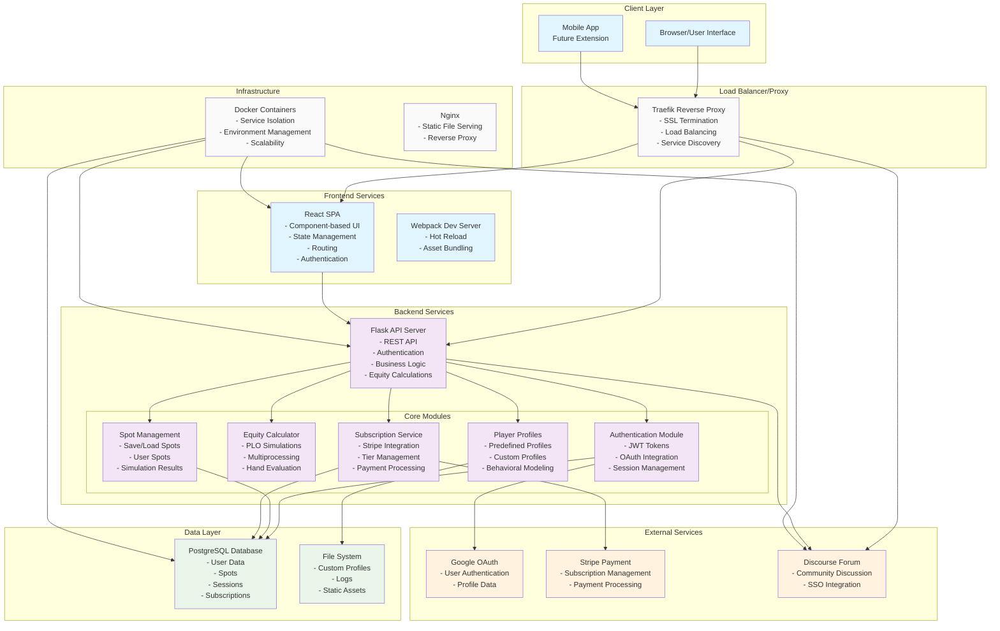

# PLOSolver Architecture Overview

This document provides a comprehensive overview of the PLOSolver application architecture, including system components, data flow, and infrastructure design.

## System Architecture

## Architecture Components

### Client Layer
- **Browser Interface**: Primary web-based user interface
- **Mobile App**: Future extension for mobile platforms

### Frontend Services
- **React SPA**: Single-page application with component-based architecture
- **Webpack Dev Server**: Development server with hot reload capabilities

### Backend Services
- **Flask API Server**: RESTful API server handling business logic
- **Core Modules**:
  - **Authentication**: JWT tokens, OAuth, session management
  - **Equity Calculator**: PLO simulations with multiprocessing
  - **Spot Management**: Save/load poker scenarios
  - **Player Profiles**: AI opponent modeling
  - **Subscription Service**: Payment and tier management

### External Integrations
- **Google OAuth**: User authentication and profile data
- **Stripe**: Payment processing and subscription management
- **Discourse Forum**: Community platform with SSO

### Data Layer
- **PostgreSQL**: Primary database for structured data
- **File System**: Custom profiles, logs, and static assets

### Infrastructure
- **Docker**: Containerized services for scalability
- **Traefik**: Reverse proxy with SSL termination and load balancing

## Key Features

1. **Multi-Mode Poker Analysis**
   - Live Mode: Interactive poker gameplay
   - Spot Mode: Scenario analysis and saving
   - Training Mode: AI opponent training

2. **Advanced Equity Calculations**
   - Monte Carlo simulations
   - Multiprocessing for performance
   - Hand strength analysis

3. **User Management**
   - OAuth authentication
   - Subscription tiers
   - Profile management

4. **Community Features**
   - Integrated forum
   - User discussions
   - Knowledge sharing

5. **Scalable Infrastructure**
   - Docker containerization
   - Load balancing
   - SSL/TLS encryption 