# PLOSolver Backend Architecture

This document describes the Flask backend architecture, API structure, and core business logic components used in the PLOSolver application.

## Backend API Structure Diagram

```mermaid
graph TB
    subgraph "Flask Application Server"
        FlaskApp[Flask App<br/>equity_server.py<br/>- Configuration<br/>- CORS Setup<br/>- JWT Management<br/>- Blueprint Registration]
        
        subgraph "Authentication System"
            AuthRoutes[Authentication Routes<br/>/auth/*<br/>- User Registration<br/>- Login/Logout<br/>- JWT Token Management<br/>- OAuth Integration]
            AuthUtils[Authentication Utilities<br/>- Token Validation<br/>- Password Hashing<br/>- OAuth Verification<br/>- Session Management]
        end
        
        subgraph "Core Business Logic"
            EquityEngine[Equity Calculation Engine<br/>- PLO Hand Evaluation<br/>- Monte Carlo Simulation<br/>- Multiprocessing<br/>- Hand Strength Analysis]
            
            SpotRoutes[Spot Management Routes<br/>/spots/*<br/>- Save/Load Spots<br/>- CRUD Operations<br/>- User Authorization<br/>- Result Storage]
            
            ProfileSystem[Player Profile System<br/>- Predefined Profiles<br/>- Custom Profile Creation<br/>- Behavioral Modeling<br/>- Profile Management]
        end
        
        subgraph "Business Features"
            SubscriptionRoutes[Subscription Routes<br/>/api/subscription/*<br/>- Stripe Integration<br/>- Plan Management<br/>- Payment Processing<br/>- Tier Validation]
            
            DocsRoutes[Documentation Routes<br/>/docs/*<br/>- API Documentation<br/>- Interactive Docs<br/>- Feature Guides]
            
            ForumRoutes[Forum Integration Routes<br/>/discourse/*<br/>- SSO Provider<br/>- User Sync<br/>- Forum Authentication<br/>- Community Features]
        end
        
        subgraph "Core Endpoints"
            HealthCheck[Health Check<br/>/health<br/>- System Status<br/>- Connectivity Test<br/>- Service Monitoring]
            
            EquityAPI[Equity Calculation API<br/>/simulated-equity<br/>- Hand vs Hand<br/>- Board Analysis<br/>- Probability Calculations]
            
            SpotSimulation[Spot Simulation API<br/>/spot-simulation<br/>- Multi-player Analysis<br/>- Scenario Modeling<br/>- Advanced Calculations]
            
            ProfileAPI[Player Profile API<br/>/api/player-profiles<br/>- Profile CRUD<br/>- Custom Profiles<br/>- Behavioral Settings]
            
            ProfileSimulation[Profile Simulation API<br/>/api/simulate-vs-profiles<br/>- AI Opponent Testing<br/>- Strategy Analysis<br/>- Exploitation Detection]
        end
    end
    
    subgraph "Data Models"
        UserModel[User Model<br/>- Authentication Data<br/>- Subscription Info<br/>- Profile Information<br/>- OAuth Integration]
        
        SessionModel[UserSession Model<br/>- JWT Token Tracking<br/>- Session Management<br/>- Security Features<br/>- Expiration Handling]
        
        SpotModel[Spot Model<br/>- Game Configuration<br/>- Player Hands<br/>- Board States<br/>- Simulation Results]
        
        ProfileModel[PlayerProfile Model<br/>- Behavioral Parameters<br/>- Playing Style<br/>- Aggression Metrics<br/>- Positional Awareness]
    end
    
    subgraph "External Integrations"
        GoogleOAuth[Google OAuth<br/>- User Authentication<br/>- Profile Data<br/>- Social Login]
        
        StripeAPI[Stripe API<br/>- Payment Processing<br/>- Subscription Management<br/>- Webhook Handling]
        
        DiscourseForum[Discourse Forum<br/>- Community Platform<br/>- SSO Integration<br/>- User Synchronization]
    end
    
    %% Flask app relationships
    FlaskApp --> AuthRoutes
    FlaskApp --> SpotRoutes
    FlaskApp --> SubscriptionRoutes
    FlaskApp --> DocsRoutes
    FlaskApp --> ForumRoutes
    
    FlaskApp --> HealthCheck
    FlaskApp --> EquityAPI
    FlaskApp --> SpotSimulation
    FlaskApp --> ProfileAPI
    FlaskApp --> ProfileSimulation
    
    %% Authentication system
    AuthRoutes --> AuthUtils
    AuthRoutes --> UserModel
    AuthRoutes --> SessionModel
    AuthUtils --> GoogleOAuth
    
    %% Core business logic
    EquityAPI --> EquityEngine
    SpotSimulation --> EquityEngine
    SpotRoutes --> SpotModel
    ProfileAPI --> ProfileModel
    ProfileSimulation --> ProfileSystem
    ProfileSystem --> ProfileModel
    
    %% Business features
    SubscriptionRoutes --> StripeAPI
    SubscriptionRoutes --> UserModel
    ForumRoutes --> DiscourseForum
    
    %% Data model relationships
    UserModel --> SessionModel
    UserModel --> SpotModel
    
    classDef flask fill:#e3f2fd
    classDef route fill:#f3e5f5
    classDef engine fill:#e8f5e8
    classDef model fill:#fff3e0
    classDef external fill:#fce4ec
    classDef endpoint fill:#f1f8e9
    
    class FlaskApp flask
    class AuthRoutes,SpotRoutes,SubscriptionRoutes,DocsRoutes,ForumRoutes route
    class EquityEngine,ProfileSystem engine
    class UserModel,SessionModel,SpotModel,ProfileModel model
    class GoogleOAuth,StripeAPI,DiscourseForum external
    class HealthCheck,EquityAPI,SpotSimulation,ProfileAPI,ProfileSimulation endpoint
```



## Core Components

### 1. Flask Application Server (equity_server.py)

```python
app = Flask(__name__)

# Configuration
app.config['SECRET_KEY'] = os.getenv('SECRET_KEY', secrets.token_hex(32))
app.config['SQLALCHEMY_DATABASE_URI'] = os.getenv('DATABASE_URL', 'sqlite:///plosolver.db')
app.config['JWT_SECRET_KEY'] = os.getenv('JWT_SECRET_KEY', secrets.token_hex(32))
app.config['JWT_ACCESS_TOKEN_EXPIRES'] = timedelta(hours=1)
app.config['JWT_REFRESH_TOKEN_EXPIRES'] = timedelta(days=30)

# Initialize extensions
db.init_app(app)
bcrypt.init_app(app)
jwt = JWTManager(app)
migrate = Migrate(app, db)

# Register blueprints
app.register_blueprint(auth_routes)
app.register_blueprint(spot_routes)
app.register_blueprint(subscription_bp, url_prefix='/api')
app.register_blueprint(discourse_routes)
app.register_blueprint(docs_bp)
```

### 2. Authentication System

#### Authentication Routes (`auth_routes.py`)
```python
@auth_routes.route('/register', methods=['POST'])
def register():
    # User registration with email/password
    # OAuth integration support
    # Password validation and hashing
    pass

@auth_routes.route('/login', methods=['POST'])
def login():
    # Email/username login
    # JWT token generation
    # Session management
    pass

@auth_routes.route('/google', methods=['POST'])
def google_auth():
    # Google OAuth authentication
    # User creation/retrieval
    # Token generation
    pass

@auth_routes.route('/logout', methods=['POST'])
@auth_required
def logout():
    # Session invalidation
    # Token revocation
    pass
```

#### Authentication Utilities (`auth_utils.py`)
```python
def create_user_tokens(user_id):
    # Generate JWT access and refresh tokens
    # Create user session record
    # Return tokens
    pass

def verify_google_token(id_token):
    # Verify Google OAuth token
    # Extract user information
    # Return user data or error
    pass

def auth_required(f):
    # Decorator for protected routes
    # JWT token validation
    # User authentication check
    pass
```

### 3. Equity Calculation Engine

#### Core Simulation Functions
```python
def simulate_equity(hands, board, num_iterations=10000, double_board=False):
    """
    Calculate equity for multiple hands using Monte Carlo simulation
    - Multiprocessing for performance
    - Hand strength evaluation
    - Statistical analysis
    """
    pass

def evaluate_plo_hand(hole_cards, board):
    """
    Evaluate PLO hand strength using Treys library
    - Best 5-card combination
    - Hand ranking and scoring
    """
    pass

def categorize_hand_strength(score):
    """
    Categorize hand strength for analysis
    - High card through straight flush
    - Statistical distribution
    """
    pass
```

#### Multiprocessing Implementation
```python
def run_equity_simulation_chunk(hands, board, num_iterations, double_board):
    """
    Worker function for multiprocessing equity calculation
    - Parallel processing of simulation chunks
    - Performance optimization
    - Result aggregation
    """
    pass
```

### 4. Spot Management System

#### Spot Routes (`spot_routes.py`)
```python
@spot_routes.route('', methods=['POST'])
@auth_required
def save_spot():
    # Save poker scenario configuration
    # Store simulation results
    # User authorization
    pass

@spot_routes.route('', methods=['GET'])
@auth_required
def get_spots():
    # Retrieve user's saved spots
    # Pagination and filtering
    pass

@spot_routes.route('/<spot_id>', methods=['PUT'])
@auth_required
def update_spot(spot_id):
    # Update spot configuration
    # Results storage
    # Ownership validation
    pass
```

### 5. Player Profile System

#### Profile Management
```python
class PlayerProfileManager:
    def __init__(self):
        self.predefined_profiles = PREDEFINED_PROFILES
        self.custom_profiles = {}
    
    def add_custom_profile(self, profile):
        # Add user-created profile
        # Validation and storage
        pass
    
    def get_profile(self, name):
        # Retrieve profile by name
        # Predefined or custom
        pass
```

#### Profile Simulation
```python
@app.route('/api/simulate-vs-profiles', methods=['POST'])
def simulate_vs_profiles():
    # Simulate against AI profiles
    # Behavioral modeling
    # Exploitation analysis
    pass
```

### 6. Subscription Management

#### Stripe Integration
```python
@subscription_bp.route('/create-checkout-session', methods=['POST'])
@auth_required
def create_checkout_session():
    # Create Stripe checkout session
    # Subscription plan configuration
    # Payment processing
    pass

@subscription_bp.route('/webhook', methods=['POST'])
def stripe_webhook():
    # Handle Stripe webhooks
    # Subscription status updates
    # User tier management
    pass
```

## Data Models

### User Model
```python
class User(db.Model):
    id = db.Column(db.String(36), primary_key=True, default=lambda: str(uuid.uuid4()))
    email = db.Column(db.String(255), unique=True, nullable=False, index=True)
    username = db.Column(db.String(80), unique=True, nullable=True)
    password_hash = db.Column(db.String(128), nullable=True)
    
    # OAuth fields
    google_id = db.Column(db.String(255), unique=True, nullable=True)
    facebook_id = db.Column(db.String(255), unique=True, nullable=True)
    
    # Subscription fields
    subscription_tier = db.Column(db.String(20), default='free')
    stripe_customer_id = db.Column(db.String(255), nullable=True)
    subscription_status = db.Column(db.String(20), default='active')
```

### Spot Model
```python
class Spot(db.Model):
    id = db.Column(db.String(36), primary_key=True, default=lambda: str(uuid.uuid4()))
    user_id = db.Column(db.String(36), db.ForeignKey('users.id'), nullable=False)
    name = db.Column(db.String(255), nullable=False)
    
    # Game configuration
    top_board = db.Column(db.JSON, nullable=False)
    bottom_board = db.Column(db.JSON, nullable=False)
    players = db.Column(db.JSON, nullable=False)
    simulation_runs = db.Column(db.Integer, nullable=False, default=10000)
    
    # Results
    results = db.Column(db.JSON, nullable=True)
```

### Player Profile Model
```python
class PlayerProfile:
    def __init__(self, name, description, **behavioral_params):
        self.name = name
        self.description = description
        self.hand_range_tightness = behavioral_params.get('hand_range_tightness', 0.5)
        self.preflop_aggression = behavioral_params.get('preflop_aggression', 0.5)
        self.flop_aggression = behavioral_params.get('flop_aggression', 0.5)
        # ... additional behavioral parameters
```

## Security Features

### 1. JWT Token Management
- Access tokens (1 hour expiration)
- Refresh tokens (30 days expiration)
- Token revocation and blacklisting
- Session tracking and validation

### 2. Password Security
- Bcrypt hashing with salt
- Password strength validation
- OAuth integration support
- Secure password reset (future feature)

### 3. API Security
- CORS configuration
- Request validation
- Rate limiting (future feature)
- SQL injection prevention

### 4. User Authorization
- Role-based access control
- Resource ownership validation
- Subscription tier restrictions
- API endpoint protection

## External Integrations

### 1. Google OAuth
```python
def verify_google_token(id_token):
    try:
        idinfo = id_token.verify_oauth2_token(
            id_token, requests.Request(), 
            current_app.config['GOOGLE_CLIENT_ID']
        )
        return idinfo, None
    except ValueError as e:
        return None, str(e)
```

### 2. Stripe Payment Processing
```python
def create_stripe_customer(user):
    customer = stripe.Customer.create(
        email=user.email,
        name=f"{user.first_name} {user.last_name}",
        metadata={'user_id': user.id}
    )
    return customer
```

### 3. Discourse Forum Integration
```python
@discourse_routes.route('/sso_provider', methods=['GET'])
def discourse_sso_provider():
    # Single Sign-On provider
    # User synchronization
    # Forum authentication
    pass
```

## Performance Optimizations

### 1. Database Optimization
- Proper indexing strategy
- Connection pooling
- Query optimization
- JSON field usage for flexibility

### 2. Computation Optimization
- Multiprocessing for equity calculations
- Efficient algorithm implementation
- Result caching (future feature)
- Background task processing (future feature)

### 3. Memory Management
- Efficient data structures
- Garbage collection optimization
- Connection pooling
- Resource cleanup

## Monitoring and Logging

### 1. Application Logging
```python
import logging

logger = logging.getLogger(__name__)
logger.info(f"User registered: {email}")
logger.error(f"Authentication failed: {error}")
```

### 2. Health Monitoring
```python
@app.route('/health', methods=['GET'])
def health_check():
    return jsonify({
        'status': 'OK',
        'message': 'Equity server is running',
        'timestamp': str(datetime.now())
    })
```

### 3. Error Handling
- Comprehensive exception handling
- User-friendly error messages
- Error logging and tracking
- Graceful failure handling

## Deployment Considerations

### 1. Environment Configuration
- Development vs production settings
- Environment variable management
- Secret key management
- Database configuration

### 2. Scalability
- Horizontal scaling capability
- Load balancing support
- Database connection pooling
- Caching layer integration

### 3. Security
- SSL/TLS configuration
- Secure header implementation
- Input validation and sanitization
- Rate limiting and DoS protection 