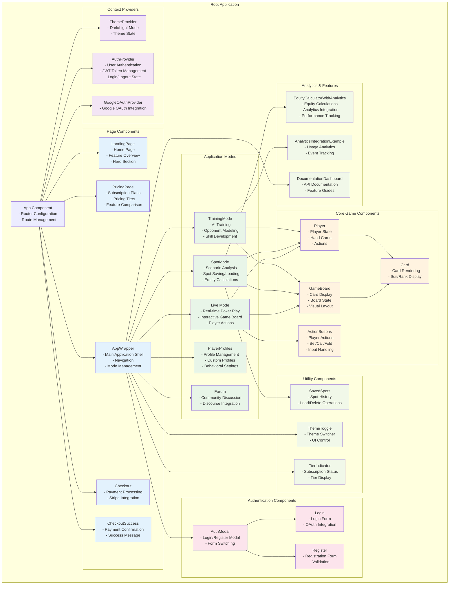

# PLOSolver Frontend Architecture

This document describes the React frontend architecture, component hierarchy, and state management patterns used in the PLOSolver application.

## Route Security

All application routes under `/app/*` are **protected** and require user authentication:

### Protected Routes (Authentication Required)
- `/app/live` - Live PLO Mode (main game interface)
- `/app/spot` - Spot Mode (scenario analysis)
- `/app/training` - Training Mode (vs player profiles)
- `/app/profiles` - Player Profiles management
- `/app/forum` - Community forum access
- `/app` - Redirects to `/app/live`

### Public Routes
- `/` - Landing page
- `/pricing` - Pricing information
- `/checkout` - Subscription checkout (requires login)
- `/checkout/success` - Payment success page

### Authentication Flow
When a user attempts to access any protected route:
1. **Loading State**: Shows spinner while checking authentication status
2. **Authenticated**: Renders the requested component
3. **Unauthenticated**: Redirects to landing page (`/`) for login

The `ProtectedRoute` component wraps all `/app/*` routes and handles this security logic transparently.

## Component Hierarchy Diagram



## Architecture Patterns

### 1. Context API for Global State

#### AuthContext
```javascript
// Manages user authentication state
const AuthContext = createContext();

export const AuthProvider = ({ children }) => {
  const [user, setUser] = useState(null);
  const [isAuthenticated, setIsAuthenticated] = useState(false);
  const [loading, setLoading] = useState(true);
  const [token, setToken] = useState(null);
  
  // Authentication methods
  const login = async (email, password) => { ... };
  const register = async (userData) => { ... };
  const googleLogin = async (tokenId) => { ... };
  const logout = async () => { ... };
  
  return (
    <AuthContext.Provider value={{
      user, isAuthenticated, loading, token,
      login, register, googleLogin, logout
    }}>
      {children}
    </AuthContext.Provider>
  );
};
```

#### ThemeContext
```javascript
// Manages application theme state
const ThemeContext = createContext();

export const ThemeProvider = ({ children }) => {
  const [theme, setTheme] = useState('light');
  
  const toggleTheme = () => {
    setTheme(prevTheme => prevTheme === 'light' ? 'dark' : 'light');
  };
  
  return (
    <ThemeContext.Provider value={{ theme, toggleTheme }}>
      {children}
    </ThemeContext.Provider>
  );
};
```

### 2. Custom Hooks for Business Logic

#### useGameState
```javascript
// Manages poker game state and actions
export const useGameState = () => {
  const [players, setPlayers] = useState([]);
  const [activePlayer, setActivePlayer] = useState(null);
  const [foldedPlayers, setFoldedPlayers] = useState([]);
  const [topFlop, setTopFlop] = useState([]);
  const [bottomFlop, setBottomFlop] = useState([]);
  const [topTurn, setTopTurn] = useState(null);
  const [bottomTurn, setBottomTurn] = useState(null);
  const [topRiver, setTopRiver] = useState(null);
  const [bottomRiver, setBottomRiver] = useState(null);
  
  const handlePlayerAction = (playerIndex, action, amount = 0) => { ... };
  const resetGame = () => { ... };
  const nextStreet = () => { ... };
  
  return {
    players, activePlayer, foldedPlayers,
    topFlop, bottomFlop, topTurn, bottomTurn, topRiver, bottomRiver,
    handlePlayerAction, resetGame, nextStreet
  };
};
```

#### useSpotMode
```javascript
// Manages spot analysis and saving functionality
export const useSpotMode = () => {
  const [spots, setSpots] = useState([]);
  const [currentSpot, setCurrentSpot] = useState(null);
  const [isLoading, setIsLoading] = useState(false);
  
  const saveSpot = async (spotData) => { ... };
  const loadSpot = async (spotId) => { ... };
  const deleteSpot = async (spotId) => { ... };
  const copyLiveModeToSpotMode = (gameState) => { ... };
  
  return {
    spots, currentSpot, isLoading,
    saveSpot, loadSpot, deleteSpot, copyLiveModeToSpotMode
  };
};
```

### 3. Route-Based Component Loading

```javascript
// App.js - Route configuration
const App = () => {
  return (
    <Router>
      <Routes>
        {/* Public routes */}
        <Route path="/" element={<LandingPage />} />
        <Route path="/pricing" element={<PricingPage />} />
        <Route path="/checkout" element={<Checkout />} />
        <Route path="/checkout/success" element={<CheckoutSuccess />} />
        
        {/* Protected app routes - require authentication */}
        <Route path="/app/live" element={
          <ProtectedRoute>
            <AppWrapper />
          </ProtectedRoute>
        } />
        <Route path="/app/spot" element={
          <ProtectedRoute>
            <AppWrapper />
          </ProtectedRoute>
        } />
        <Route path="/app/training" element={
          <ProtectedRoute>
            <AppWrapper />
          </ProtectedRoute>
        } />
        <Route path="/app/profiles" element={
          <ProtectedRoute>
            <AppWrapper />
          </ProtectedRoute>
        } />
        <Route path="/app/forum" element={
          <ProtectedRoute>
            <AppWrapper />
          </ProtectedRoute>
        } />
        
        {/* Redirect /app to /app/live (also protected) */}
        <Route path="/app" element={
          <ProtectedRoute>
            <Navigate to="/app/live" replace />
          </ProtectedRoute>
        } />
        
        {/* Catch all - redirect to home */}
        <Route path="*" element={<Navigate to="/" replace />} />
      </Routes>
    </Router>
  );
};
```

### 4. Component Composition Patterns

#### Route Protection
```javascript
// ProtectedRoute component for secured routes
const ProtectedRoute = ({ children }) => {
  const { isAuthenticated, loading } = useAuth();

  // Show loading spinner while checking authentication
  if (loading) {
    return (
      <div className="loading-container">
        <div className="loading-spinner"></div>
        <p>Loading...</p>
      </div>
    );
  }

  // Redirect to landing page if not authenticated
  if (!isAuthenticated) {
    return <Navigate to="/" replace />;
  }

  // Render the protected component if authenticated
  return children;
};
```

#### Higher-Order Components
```javascript
// withAuth HOC for protected routes (alternative approach)
const withAuth = (WrappedComponent) => {
  return (props) => {
    const { isAuthenticated, loading } = useAuth();
    
    if (loading) return <LoadingSpinner />;
    if (!isAuthenticated) return <Navigate to="/login" />;
    
    return <WrappedComponent {...props} />;
  };
};
```

#### Render Props Pattern
```javascript
// DataFetcher component using render props
const DataFetcher = ({ url, children }) => {
  const [data, setData] = useState(null);
  const [loading, setLoading] = useState(true);
  const [error, setError] = useState(null);
  
  useEffect(() => {
    fetchData(url).then(setData).catch(setError).finally(() => setLoading(false));
  }, [url]);
  
  return children({ data, loading, error });
};
```

## State Management Strategies

### 1. Local Component State
- Form inputs and UI state
- Temporary calculations
- Component-specific flags

### 2. Context API
- Global application state
- User authentication
- Theme preferences
- Cross-component communication

### 3. Custom Hooks
- Business logic abstraction
- Reusable stateful logic
- API integration
- Complex state management

### 4. Props and Lifting State Up
- Parent-child communication
- Shared state between siblings
- Event handling delegation

## Performance Optimizations

### 1. React.memo and useMemo
```javascript
// Memoized component to prevent unnecessary re-renders
const Card = React.memo(({ suit, rank, size }) => {
  const cardStyle = useMemo(() => ({
    backgroundImage: `url(/cards/${suit}_${rank}.png)`,
    width: size,
    height: size * 1.4
  }), [suit, rank, size]);
  
  return <div className="card" style={cardStyle} />;
});
```

### 2. useCallback for Event Handlers
```javascript
// Memoized event handlers
const Player = ({ player, onAction }) => {
  const handleBet = useCallback((amount) => {
    onAction(player.id, 'bet', amount);
  }, [player.id, onAction]);
  
  const handleFold = useCallback(() => {
    onAction(player.id, 'fold');
  }, [player.id, onAction]);
  
  return (
    <div className="player">
      <button onClick={handleFold}>Fold</button>
      <button onClick={() => handleBet(100)}>Bet 100</button>
    </div>
  );
};
```

### 3. Code Splitting and Lazy Loading
```javascript
// Lazy loaded components for better performance
const SpotMode = lazy(() => import('./components/SpotMode'));
const TrainingMode = lazy(() => import('./components/TrainingMode'));
const PlayerProfiles = lazy(() => import('./components/PlayerProfiles'));

// Usage with Suspense
<Suspense fallback={<LoadingSpinner />}>
  <SpotMode />
</Suspense>
```

## Testing Strategy

### 1. Unit Testing
- Individual component testing
- Custom hooks testing
- Utility function testing

### 2. Integration Testing
- Component interaction testing
- Context provider testing
- API integration testing

### 3. End-to-End Testing
- User workflow testing
- Authentication flow testing
- Payment integration testing

## Build and Development

### 1. Webpack Configuration
- Development server with hot reload
- Production optimization
- Asset bundling and minification

### 2. Environment Configuration
- Development vs production builds
- API endpoint configuration
- Feature flags and toggles

### 3. Development Tools
- React Developer Tools
- Redux DevTools (if used)
- Browser debugging tools 