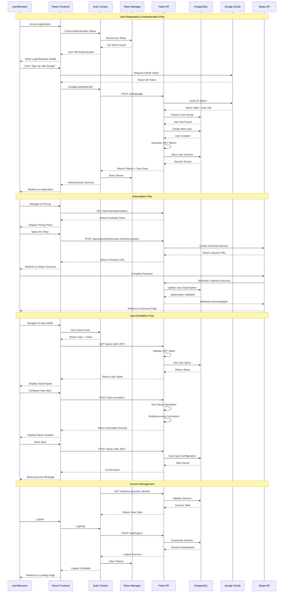

# PLOSolver Authentication Flow

This document describes the authentication and authorization system, including user registration, login processes, subscription management, and session handling.

## Authentication Sequence Diagram



## Authentication Components

### 1. Frontend Authentication System

#### AuthContext Provider
```javascript
// AuthContext.js - Global authentication state management
export const AuthProvider = ({ children }) => {
  const [user, setUser] = useState(null);
  const [isAuthenticated, setIsAuthenticated] = useState(false);
  const [loading, setLoading] = useState(true);
  const [token, setToken] = useState(null);

  // Authentication methods
  const login = async (email, password) => {
    const result = await AuthAPI.login(email, password);
    if (result.success) {
      setUser(result.user);
      setIsAuthenticated(true);
      setToken(TokenManager.getAccessToken());
    }
    return result;
  };

  const googleLogin = async (tokenId) => {
    const result = await AuthAPI.googleLogin(tokenId);
    if (result.success) {
      setUser(result.user);
      setIsAuthenticated(true);
      setToken(TokenManager.getAccessToken());
    }
    return result;
  };

  const logout = async () => {
    await AuthAPI.logout();
    setUser(null);
    setIsAuthenticated(false);
    setToken(null);
  };

  return (
    <AuthContext.Provider value={{
      user, isAuthenticated, loading, token,
      login, register, googleLogin, logout
    }}>
      {children}
    </AuthContext.Provider>
  );
};
```

#### Token Management
```javascript
// TokenManager - JWT token storage and validation
export class TokenManager {
  static setTokens(accessToken, refreshToken) {
    localStorage.setItem('access_token', accessToken);
    localStorage.setItem('refresh_token', refreshToken);
  }

  static getAccessToken() {
    return localStorage.getItem('access_token');
  }

  static getRefreshToken() {
    return localStorage.getItem('refresh_token');
  }

  static clearTokens() {
    localStorage.removeItem('access_token');
    localStorage.removeItem('refresh_token');
  }

  static isLoggedIn() {
    const token = this.getAccessToken();
    return token && !this.isTokenExpired(token);
  }

  static isTokenExpired(token) {
    try {
      const decoded = jwt_decode(token);
      return decoded.exp < Date.now() / 1000;
    } catch (error) {
      return true;
    }
  }
}
```

#### Authentication API
```javascript
// AuthAPI - Backend communication for authentication
export class AuthAPI {
  static async login(email, password) {
    try {
      const response = await axios.post('/auth/login', { email, password });
      const { access_token, refresh_token, user } = response.data;
      
      TokenManager.setTokens(access_token, refresh_token);
      return { success: true, user, message: 'Login successful' };
    } catch (error) {
      return { success: false, error: error.response?.data?.error || 'Login failed' };
    }
  }

  static async googleLogin(tokenId) {
    try {
      const response = await axios.post('/auth/google', { id_token: tokenId });
      const { access_token, refresh_token, user } = response.data;
      
      TokenManager.setTokens(access_token, refresh_token);
      return { success: true, user, message: 'Google login successful' };
    } catch (error) {
      return { success: false, error: error.response?.data?.error || 'Google login failed' };
    }
  }

  static async logout() {
    try {
      const token = TokenManager.getAccessToken();
      if (token) {
        await axios.post('/auth/logout', {}, {
          headers: { Authorization: `Bearer ${token}` }
        });
      }
    } catch (error) {
      console.error('Logout error:', error);
    } finally {
      TokenManager.clearTokens();
    }
  }
}
```

### 2. Backend Authentication System

#### Authentication Routes
```python
# auth_routes.py - Authentication endpoint handlers
@auth_routes.route('/register', methods=['POST'])
def register():
    try:
        data = request.get_json()
        email = data.get('email', '').strip().lower()
        password = data.get('password', '')
        
        # Validate input
        if not validate_email(email):
            return jsonify({'error': 'Invalid email format'}), 400
        
        is_valid, message = validate_password(password)
        if not is_valid:
            return jsonify({'error': message}), 400
        
        # Check if user exists
        existing_user = User.query.filter_by(email=email).first()
        if existing_user:
            return jsonify({'error': 'User already exists'}), 409
        
        # Create new user
        user = User(email=email, password=password)
        db.session.add(user)
        db.session.commit()
        
        # Generate tokens
        access_token, refresh_token = create_user_tokens(user.id)
        user.update_last_login()
        
        return jsonify({
            'message': 'Registration successful',
            'user': user.to_dict(),
            'access_token': access_token,
            'refresh_token': refresh_token
        }), 201
        
    except Exception as e:
        db.session.rollback()
        return jsonify({'error': 'Registration failed'}), 500

@auth_routes.route('/google', methods=['POST'])
def google_auth():
    try:
        data = request.get_json()
        id_token = data.get('id_token')
        
        # Verify Google token
        user_info, error = verify_google_token(id_token)
        if error:
            return jsonify({'error': error}), 401
        
        # Get or create user
        user = get_or_create_oauth_user(user_info, 'google')
        
        # Generate tokens
        access_token, refresh_token = create_user_tokens(user.id)
        user.update_last_login()
        
        return jsonify({
            'message': 'Google authentication successful',
            'user': user.to_dict(),
            'access_token': access_token,
            'refresh_token': refresh_token
        }), 200
        
    except Exception as e:
        return jsonify({'error': 'Google authentication failed'}), 500

@auth_routes.route('/logout', methods=['POST'])
@auth_required
def logout():
    try:
        user = request.current_user
        jti = get_jwt()['jti']
        
        # Revoke current session
        revoke_user_token(jti)
        
        return jsonify({'message': 'Logout successful'}), 200
        
    except Exception as e:
        return jsonify({'error': 'Logout failed'}), 500
```

#### Authentication Utilities
```python
# auth_utils.py - Authentication helper functions
def create_user_tokens(user_id):
    """Create JWT access and refresh tokens for user"""
    access_token = create_access_token(identity=user_id)
    refresh_token = create_refresh_token(identity=user_id)
    
    # Store session information
    access_jti = get_jti(access_token)
    refresh_jti = get_jti(refresh_token)
    
    # Create session record
    session = UserSession(
        user_id=user_id,
        token_jti=access_jti,
        expires_at=datetime.utcnow() + current_app.config['JWT_ACCESS_TOKEN_EXPIRES'],
        ip_address=request.remote_addr,
        user_agent=request.headers.get('User-Agent', '')
    )
    db.session.add(session)
    db.session.commit()
    
    return access_token, refresh_token

def verify_google_token(id_token):
    """Verify Google OAuth ID token"""
    try:
        idinfo = id_token.verify_oauth2_token(
            id_token, 
            requests.Request(),
            current_app.config['GOOGLE_CLIENT_ID']
        )
        return idinfo, None
    except ValueError as e:
        return None, str(e)

def get_or_create_oauth_user(user_info, provider):
    """Get existing OAuth user or create new one"""
    if provider == 'google':
        user = User.query.filter_by(google_id=user_info['sub']).first()
        
        if not user:
            # Check if user exists by email
            user = User.query.filter_by(email=user_info['email']).first()
            
            if user:
                # Link Google account to existing user
                user.google_id = user_info['sub']
                user.profile_picture = user_info.get('picture')
            else:
                # Create new user
                user = User(
                    email=user_info['email'],
                    first_name=user_info.get('given_name'),
                    last_name=user_info.get('family_name'),
                    google_id=user_info['sub'],
                    profile_picture=user_info.get('picture'),
                    email_verified=user_info.get('email_verified', False)
                )
                db.session.add(user)
            
            db.session.commit()
    
    return user

def auth_required(f):
    """Decorator for protected routes"""
    @wraps(f)
    @jwt_required()
    def decorated_function(*args, **kwargs):
        try:
            user_id = get_jwt_identity()
            user = User.query.get(user_id)
            
            if not user or not user.is_active:
                return jsonify({'error': 'User not found or inactive'}), 401
            
            request.current_user = user
            return f(*args, **kwargs)
            
        except Exception as e:
            return jsonify({'error': 'Authentication failed'}), 401
    
    return decorated_function
```

### 3. Session Management

#### Session Model
```python
# models.py - UserSession model
class UserSession(db.Model):
    __tablename__ = 'user_sessions'
    
    id = db.Column(db.String(36), primary_key=True, default=lambda: str(uuid.uuid4()))
    user_id = db.Column(db.String(36), db.ForeignKey('users.id'), nullable=False)
    token_jti = db.Column(db.String(255), unique=True, nullable=False)
    ip_address = db.Column(db.String(45), nullable=True)
    user_agent = db.Column(db.String(500), nullable=True)
    created_at = db.Column(db.DateTime, default=datetime.utcnow)
    expires_at = db.Column(db.DateTime, nullable=False)
    is_active = db.Column(db.Boolean, default=True)
    
    user = db.relationship('User', backref=db.backref('sessions', lazy=True))
    
    def deactivate(self):
        """Deactivate this session"""
        self.is_active = False
        db.session.commit()
    
    def is_expired(self):
        """Check if session is expired"""
        return datetime.utcnow() > self.expires_at
```

#### JWT Token Validation
```python
# JWT token blacklist check
@jwt.token_in_blocklist_loader
def check_if_token_revoked(jwt_header, jwt_payload):
    jti = jwt_payload['jti']
    session = UserSession.query.filter_by(token_jti=jti, is_active=True).first()
    return session is None or session.is_expired()

def revoke_user_token(jti):
    """Revoke a specific user token"""
    session = UserSession.query.filter_by(token_jti=jti).first()
    if session:
        session.deactivate()

def revoke_all_user_tokens(user_id):
    """Revoke all tokens for a user"""
    sessions = UserSession.query.filter_by(user_id=user_id, is_active=True).all()
    for session in sessions:
        session.deactivate()
```

## Subscription Management

### 1. Stripe Integration

#### Subscription Routes
```python
# subscription_routes.py - Stripe integration
@subscription_bp.route('/create-checkout-session', methods=['POST'])
@auth_required
def create_checkout_session():
    try:
        data = request.get_json()
        plan_id = data.get('plan_id')
        user = request.current_user
        
        # Create or get Stripe customer
        if not user.stripe_customer_id:
            customer = stripe.Customer.create(
                email=user.email,
                name=f"{user.first_name} {user.last_name}",
                metadata={'user_id': user.id}
            )
            user.stripe_customer_id = customer.id
            db.session.commit()
        
        # Create checkout session
        session = stripe.checkout.Session.create(
            customer=user.stripe_customer_id,
            payment_method_types=['card'],
            line_items=[{
                'price': plan_id,
                'quantity': 1,
            }],
            mode='subscription',
            success_url=f"{current_app.config['FRONTEND_URL']}/checkout/success",
            cancel_url=f"{current_app.config['FRONTEND_URL']}/pricing",
        )
        
        return jsonify({'checkout_url': session.url}), 200
        
    except Exception as e:
        return jsonify({'error': 'Failed to create checkout session'}), 500

@subscription_bp.route('/webhook', methods=['POST'])
def stripe_webhook():
    payload = request.data
    sig_header = request.headers.get('Stripe-Signature')
    
    try:
        event = stripe.Webhook.construct_event(
            payload, sig_header, current_app.config['STRIPE_WEBHOOK_SECRET']
        )
    except ValueError:
        return jsonify({'error': 'Invalid payload'}), 400
    except stripe.error.SignatureVerificationError:
        return jsonify({'error': 'Invalid signature'}), 400
    
    # Handle subscription events
    if event['type'] == 'customer.subscription.created':
        handle_subscription_created(event['data']['object'])
    elif event['type'] == 'customer.subscription.updated':
        handle_subscription_updated(event['data']['object'])
    elif event['type'] == 'customer.subscription.deleted':
        handle_subscription_deleted(event['data']['object'])
    
    return jsonify({'status': 'success'}), 200

def handle_subscription_created(subscription):
    """Handle new subscription creation"""
    customer_id = subscription['customer']
    user = User.query.filter_by(stripe_customer_id=customer_id).first()
    
    if user:
        user.stripe_subscription_id = subscription['id']
        user.subscription_status = subscription['status']
        user.subscription_current_period_end = datetime.fromtimestamp(
            subscription['current_period_end']
        )
        
        # Determine tier from price
        price_id = subscription['items']['data'][0]['price']['id']
        user.subscription_tier = get_tier_from_price_id(price_id)
        
        db.session.commit()
```

### 2. Subscription Tiers

#### Tier Validation
```python
# Subscription tier checking
def require_subscription_tier(required_tier):
    """Decorator to check subscription tier"""
    def decorator(f):
        @wraps(f)
        @auth_required
        def decorated_function(*args, **kwargs):
            user = request.current_user
            
            tier_hierarchy = {'free': 0, 'pro': 1, 'elite': 2}
            user_tier_level = tier_hierarchy.get(user.subscription_tier, 0)
            required_tier_level = tier_hierarchy.get(required_tier, 0)
            
            if user_tier_level < required_tier_level:
                return jsonify({
                    'error': f'This feature requires {required_tier} subscription',
                    'current_tier': user.subscription_tier,
                    'required_tier': required_tier
                }), 403
            
            return f(*args, **kwargs)
        return decorated_function
    return decorator

# Usage example
@app.route('/api/advanced-simulation', methods=['POST'])
@require_subscription_tier('pro')
def advanced_simulation():
    # Pro-tier only feature
    pass
```

## Security Features

### 1. Password Security

#### Password Validation
```python
def validate_password(password):
    """Validate password strength"""
    if len(password) < 8:
        return False, "Password must be at least 8 characters long"
    
    if not re.search(r"[A-Z]", password):
        return False, "Password must contain at least one uppercase letter"
    
    if not re.search(r"[a-z]", password):
        return False, "Password must contain at least one lowercase letter"
    
    if not re.search(r"\d", password):
        return False, "Password must contain at least one digit"
    
    if not re.search(r"[!@#$%^&*(),.?\":{}|<>]", password):
        return False, "Password must contain at least one special character"
    
    return True, "Password is valid"

def validate_email(email):
    """Validate email format"""
    pattern = r'^[a-zA-Z0-9._%+-]+@[a-zA-Z0-9.-]+\.[a-zA-Z]{2,}$'
    return re.match(pattern, email) is not None
```

#### Password Hashing
```python
# User model password methods
class User(db.Model):
    def set_password(self, password):
        """Hash and set password"""
        self.password_hash = bcrypt.generate_password_hash(password).decode('utf-8')
    
    def check_password(self, password):
        """Check if provided password matches hash"""
        if not self.password_hash:
            return False
        return bcrypt.check_password_hash(self.password_hash, password)
```

### 2. API Security

#### Rate Limiting (Future Enhancement)
```python
from flask_limiter import Limiter
from flask_limiter.util import get_remote_address

limiter = Limiter(
    app,
    key_func=get_remote_address,
    default_limits=["200 per day", "50 per hour"]
)

@auth_routes.route('/login', methods=['POST'])
@limiter.limit("5 per minute")
def login():
    # Login endpoint with rate limiting
    pass
```

#### CORS Configuration
```python
# CORS setup for secure cross-origin requests
CORS(app, 
     origins=[
         "http://localhost:3000",
         "https://plosolver.com"
     ],
     methods=['GET', 'POST', 'PUT', 'DELETE', 'OPTIONS'],
     allow_headers=['Content-Type', 'Authorization'],
     supports_credentials=True)
```

## Error Handling and Logging

### 1. Authentication Error Handling

```python
# Comprehensive error handling
@auth_routes.errorhandler(401)
def unauthorized_error(error):
    return jsonify({
        'error': 'Unauthorized access',
        'message': 'Please log in to access this resource'
    }), 401

@auth_routes.errorhandler(403)
def forbidden_error(error):
    return jsonify({
        'error': 'Forbidden',
        'message': 'You do not have permission to access this resource'
    }), 403

@auth_routes.errorhandler(422)
def validation_error(error):
    return jsonify({
        'error': 'Validation failed',
        'message': 'Please check your input data'
    }), 422
```

### 2. Security Logging

```python
# Security event logging
import logging

security_logger = logging.getLogger('security')

def log_security_event(event_type, user_id=None, ip_address=None, details=None):
    """Log security-related events"""
    security_logger.info(f"Security Event: {event_type}", extra={
        'user_id': user_id,
        'ip_address': ip_address,
        'details': details,
        'timestamp': datetime.utcnow().isoformat()
    })

# Usage examples
log_security_event('LOGIN_SUCCESS', user.id, request.remote_addr)
log_security_event('LOGIN_FAILED', None, request.remote_addr, {'email': email})
log_security_event('SUBSCRIPTION_CREATED', user.id, request.remote_addr, {'tier': tier})
```

This comprehensive authentication system provides secure user management, subscription handling, and session management with robust error handling and security logging. 