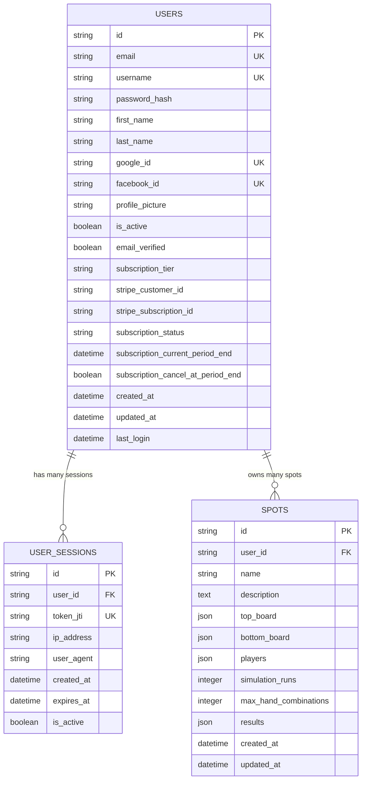

# PLOSolver Database Schema

This document describes the database schema and data model for the PLOSolver application.

## Entity Relationship Diagram



## Table Descriptions

### USERS
The main user table storing account information, authentication data, and subscription details.

**Key Fields:**
- `id`: UUID primary key
- `email`: Unique email address for authentication
- `username`: Optional unique username
- `password_hash`: Bcrypt hashed password (nullable for OAuth users)
- `google_id`/`facebook_id`: OAuth provider IDs
- `subscription_tier`: Current subscription level (free, pro, elite)
- `stripe_customer_id`/`stripe_subscription_id`: Stripe integration fields

**Indexes:**
- Primary key on `id`
- Unique indexes on `email`, `username`, `google_id`, `facebook_id`

### USER_SESSIONS
Session management table for JWT token tracking and security.

**Key Fields:**
- `id`: UUID primary key
- `user_id`: Foreign key to USERS table
- `token_jti`: JWT ID for token validation
- `ip_address`/`user_agent`: Security tracking fields
- `expires_at`: Session expiration timestamp
- `is_active`: Session status flag

**Indexes:**
- Primary key on `id`
- Foreign key on `user_id`
- Unique index on `token_jti`

### SPOTS
Poker scenario storage with game configurations and simulation results.

**Key Fields:**
- `id`: UUID primary key
- `user_id`: Foreign key to USERS table
- `name`: User-defined spot name
- `description`: Optional description
- `top_board`/`bottom_board`: JSON arrays of cards
- `players`: JSON array of player objects with hole cards
- `simulation_runs`: Number of Monte Carlo iterations
- `max_hand_combinations`: Limit for hand combinations
- `results`: JSON object with simulation results

**Indexes:**
- Primary key on `id`
- Foreign key on `user_id`

## Data Types

### JSON Fields

#### `top_board` / `bottom_board`
```json
["Ah", "Kh", "Qh", "Jh", "Th"]
```

#### `players`
```json
[
  {
    "name": "Player 1",
    "cards": ["As", "Ad", "Kc", "Kd"],
    "position": "BTN",
    "is_hero": true
  },
  {
    "name": "Player 2",
    "cards": ["Qs", "Qd", "Jc", "Jd"],
    "position": "BB",
    "is_hero": false
  }
]
```

#### `results`
```json
{
  "top_equity": [0.45, 0.55],
  "bottom_equity": [0.40, 0.60],
  "scoop_equity": [0.25, 0.75],
  "hand_categories": {
    "high_card": 0.15,
    "pair": 0.35,
    "two_pair": 0.25,
    "trips": 0.15,
    "straight": 0.05,
    "flush": 0.03,
    "full_house": 0.015,
    "quads": 0.001,
    "straight_flush": 0.0001
  },
  "simulation_stats": {
    "total_iterations": 10000,
    "execution_time": 2.5,
    "hands_analyzed": 50000
  }
}
```

## Constraints and Relationships

### Foreign Keys
- `USER_SESSIONS.user_id` → `USERS.id`
- `SPOTS.user_id` → `USERS.id`

### Unique Constraints
- `USERS.email` (case-insensitive)
- `USERS.username` (nullable)
- `USERS.google_id` (nullable)
- `USERS.facebook_id` (nullable)
- `USER_SESSIONS.token_jti`

### Check Constraints
- `USERS.subscription_tier` IN ('free', 'pro', 'elite')
- `USERS.subscription_status` IN ('active', 'canceled', 'past_due', 'unpaid')
- `SPOTS.simulation_runs` > 0
- `SPOTS.max_hand_combinations` > 0

## Migration History

The database uses Flask-Migrate with Alembic for version control. Migration files are stored in `backend/migrations/versions/`.

### Current Migrations
- `82a93951111e`: Add subscription fields to user model

## Performance Considerations

1. **Indexing Strategy**
   - Primary keys for fast lookups
   - Unique constraints for data integrity
   - Foreign key indexes for join performance

2. **JSON Field Usage**
   - PostgreSQL native JSON support for flexible data storage
   - Efficient querying with JSON operators
   - Proper indexing on frequently queried JSON fields

3. **Session Management**
   - Automatic cleanup of expired sessions
   - Optimized token validation queries
   - Minimal session data storage

## Security Features

1. **Password Security**
   - Bcrypt hashing with salt
   - Nullable passwords for OAuth users
   - Password strength validation

2. **Session Security**
   - JWT token tracking
   - IP address and user agent logging
   - Session expiration management
   - Token revocation capabilities

3. **Data Privacy**
   - User data isolation
   - Secure OAuth integration
   - Audit trail with timestamps 