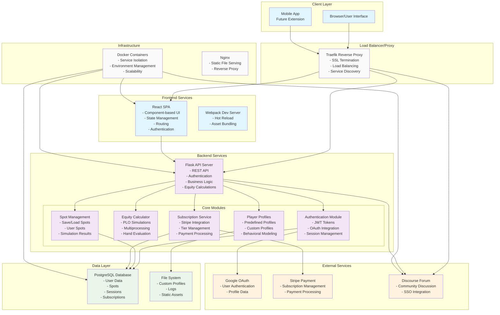
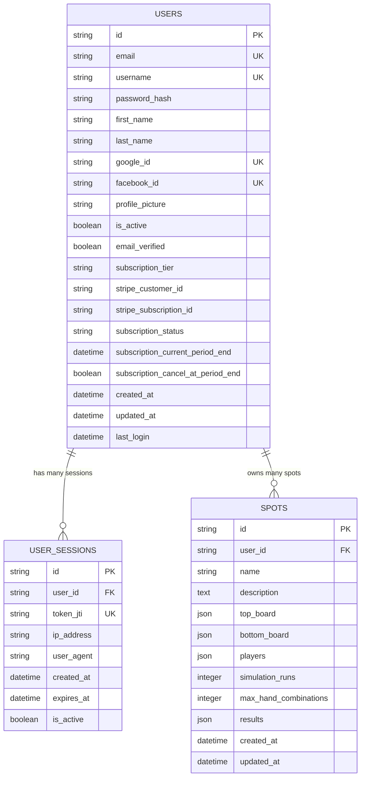
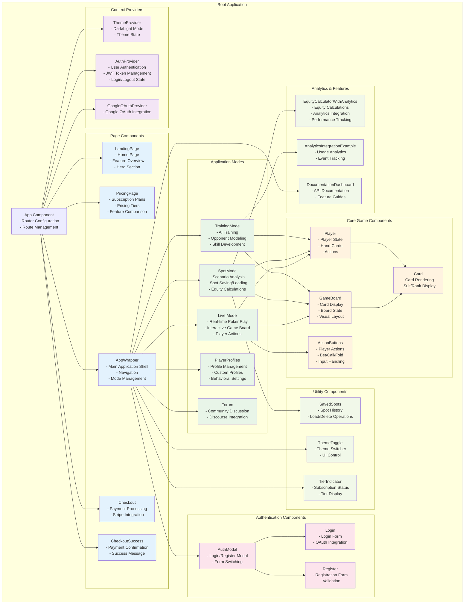
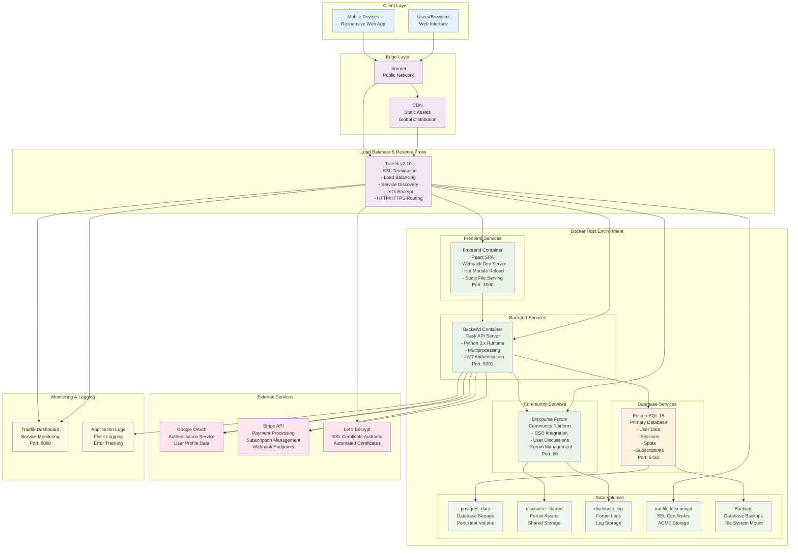
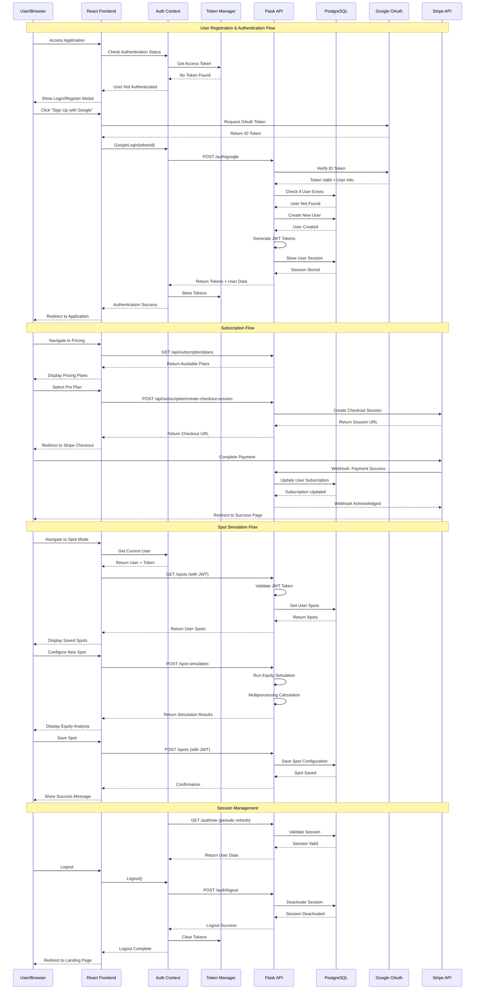

# PLOSolver UML and Architecture Diagrams

This document contains all the UML and architecture diagrams for the PLOSolver application. These diagrams provide visual representations of the system architecture, component relationships, data flow, and deployment infrastructure.

## Table of Contents

1. [System Architecture Overview](#system-architecture-overview)
2. [Database Schema (ERD)](#database-schema-erd)
3. [React Component Hierarchy](#react-component-hierarchy)
4. [Backend API Structure](#backend-api-structure)
5. [Deployment Infrastructure](#deployment-infrastructure)
6. [Authentication Flow](#authentication-flow)

---

## System Architecture Overview

High-level overview of the entire PLOSolver system showing all major components and their relationships.

---

## Database Schema (ERD)

Entity Relationship Diagram showing the database structure and relationships between tables.

---

## React Component Hierarchy

Component structure and relationships in the React frontend application.

---

## Backend API Structure

Flask backend architecture showing routes, services, and data flow.

```mermaid
graph TB
    subgraph "Flask Application Server"
        FlaskApp[Flask App<br/>equity_server.py<br/>- Configuration<br/>- CORS Setup<br/>- JWT Management<br/>- Blueprint Registration]
        
        subgraph "Authentication System"
            AuthRoutes[Authentication Routes<br/>/auth/*<br/>- User Registration<br/>- Login/Logout<br/>- JWT Token Management<br/>- OAuth Integration]
            AuthUtils[Authentication Utilities<br/>- Token Validation<br/>- Password Hashing<br/>- OAuth Verification<br/>- Session Management]
        end
        
        subgraph "Core Business Logic"
            EquityEngine[Equity Calculation Engine<br/>- PLO Hand Evaluation<br/>- Monte Carlo Simulation<br/>- Multiprocessing<br/>- Hand Strength Analysis]
            
            SpotRoutes[Spot Management Routes<br/>/spots/*<br/>- Save/Load Spots<br/>- CRUD Operations<br/>- User Authorization<br/>- Result Storage]
            
            ProfileSystem[Player Profile System<br/>- Predefined Profiles<br/>- Custom Profile Creation<br/>- Behavioral Modeling<br/>- Profile Management]
        end
        
        subgraph "Business Features"
            SubscriptionRoutes[Subscription Routes<br/>/api/subscription/*<br/>- Stripe Integration<br/>- Plan Management<br/>- Payment Processing<br/>- Tier Validation]
            
            DocsRoutes[Documentation Routes<br/>/docs/*<br/>- API Documentation<br/>- Interactive Docs<br/>- Feature Guides]
            
            ForumRoutes[Forum Integration Routes<br/>/discourse/*<br/>- SSO Provider<br/>- User Sync<br/>- Forum Authentication<br/>- Community Features]
        end
        
        subgraph "Core Endpoints"
            HealthCheck[Health Check<br/>/health<br/>- System Status<br/>- Connectivity Test<br/>- Service Monitoring]
            
            EquityAPI[Equity Calculation API<br/>/simulated-equity<br/>- Hand vs Hand<br/>- Board Analysis<br/>- Probability Calculations]
            
            SpotSimulation[Spot Simulation API<br/>/spot-simulation<br/>- Multi-player Analysis<br/>- Scenario Modeling<br/>- Advanced Calculations]
            
            ProfileAPI[Player Profile API<br/>/api/player-profiles<br/>- Profile CRUD<br/>- Custom Profiles<br/>- Behavioral Settings]
            
            ProfileSimulation[Profile Simulation API<br/>/api/simulate-vs-profiles<br/>- AI Opponent Testing<br/>- Strategy Analysis<br/>- Exploitation Detection]
        end
    end
    
    subgraph "Data Models"
        UserModel[User Model<br/>- Authentication Data<br/>- Subscription Info<br/>- Profile Information<br/>- OAuth Integration]
        
        SessionModel[UserSession Model<br/>- JWT Token Tracking<br/>- Session Management<br/>- Security Features<br/>- Expiration Handling]
        
        SpotModel[Spot Model<br/>- Game Configuration<br/>- Player Hands<br/>- Board States<br/>- Simulation Results]
        
        ProfileModel[PlayerProfile Model<br/>- Behavioral Parameters<br/>- Playing Style<br/>- Aggression Metrics<br/>- Positional Awareness]
    end
    
    subgraph "External Integrations"
        GoogleOAuth[Google OAuth<br/>- User Authentication<br/>- Profile Data<br/>- Social Login]
        
        StripeAPI[Stripe API<br/>- Payment Processing<br/>- Subscription Management<br/>- Webhook Handling]
        
        DiscourseForum[Discourse Forum<br/>- Community Platform<br/>- SSO Integration<br/>- User Synchronization]
    end
    
    %% Flask app relationships
    FlaskApp --> AuthRoutes
    FlaskApp --> SpotRoutes
    FlaskApp --> SubscriptionRoutes
    FlaskApp --> DocsRoutes
    FlaskApp --> ForumRoutes
    
    FlaskApp --> HealthCheck
    FlaskApp --> EquityAPI
    FlaskApp --> SpotSimulation
    FlaskApp --> ProfileAPI
    FlaskApp --> ProfileSimulation
    
    %% Authentication system
    AuthRoutes --> AuthUtils
    AuthRoutes --> UserModel
    AuthRoutes --> SessionModel
    AuthUtils --> GoogleOAuth
    
    %% Core business logic
    EquityAPI --> EquityEngine
    SpotSimulation --> EquityEngine
    SpotRoutes --> SpotModel
    ProfileAPI --> ProfileModel
    ProfileSimulation --> ProfileSystem
    ProfileSystem --> ProfileModel
    
    %% Business features
    SubscriptionRoutes --> StripeAPI
    SubscriptionRoutes --> UserModel
    ForumRoutes --> DiscourseForum
    
    %% Data model relationships
    UserModel --> SessionModel
    UserModel --> SpotModel
    
    classDef flask fill:#e3f2fd
    classDef route fill:#f3e5f5
    classDef engine fill:#e8f5e8
    classDef model fill:#fff3e0
    classDef external fill:#fce4ec
    classDef endpoint fill:#f1f8e9
    
    class FlaskApp flask
    class AuthRoutes,SpotRoutes,SubscriptionRoutes,DocsRoutes,ForumRoutes route
    class EquityEngine,ProfileSystem engine
    class UserModel,SessionModel,SpotModel,ProfileModel model
    class GoogleOAuth,StripeAPI,DiscourseForum external
    class HealthCheck,EquityAPI,SpotSimulation,ProfileAPI,ProfileSimulation endpoint
```

---

## Deployment Infrastructure

Docker-based deployment architecture with Traefik reverse proxy and service orchestration.

---

## Authentication Flow

Sequence diagram showing the complete authentication, subscription, and session management flow.

---

## Diagram Usage

### For Developers
- **System Architecture**: Understanding overall application structure
- **Database Schema**: Database design and relationship planning
- **Component Hierarchy**: Frontend development and component organization
- **Backend API Structure**: API development and service integration
- **Authentication Flow**: Security implementation and user management

### For DevOps/Infrastructure
- **Deployment Infrastructure**: Container orchestration and service management
- **System Architecture**: Service dependencies and networking
- **Authentication Flow**: Security and session management requirements

### For Product/Business
- **System Architecture**: Feature capabilities and technical limitations
- **Authentication Flow**: User experience and subscription management
- **Deployment Infrastructure**: Scalability and operational requirements

### Diagram Maintenance

These diagrams should be updated when:
- New components or services are added
- Database schema changes
- API endpoints are modified
- Deployment architecture evolves
- Authentication/authorization changes

All diagrams use Mermaid syntax and can be rendered in:
- GitHub README files
- Documentation platforms (GitBook, Notion, etc.)
- Mermaid Live Editor
- VS Code with Mermaid extensions
- CI/CD documentation generation tools 